# پیگیر

**هیچ کاری زمین نمی‌ماند.**

این یک تسک‌منیجر نیست. تفاوتش با ترلو و کلیک‌آپ در فیچر نیست، در رفتار است:
ابزارهای موجود **منفعل**‌اند و منتظر می‌مانند آدم‌ها سراغشان بیایند؛ این سامانه
**فعال** است و خودش سراغ آدم‌ها می‌رود — با پیامک دوطرفه، تشدید پله‌ای، و
گزارشی که خودش می‌نویسد و هر شنبه صبح می‌فرستد.

<p align="center">
  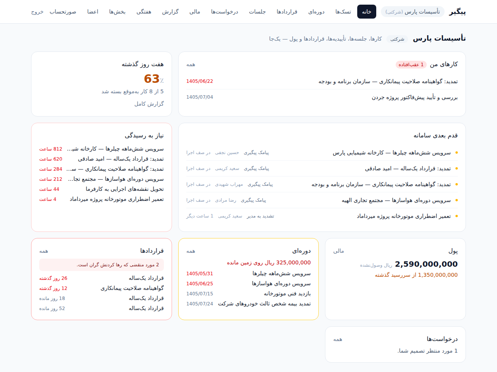
  <br><sub>داشبورد شرکتی — چه خبر است، و سامانه قدم بعدی را خودش برمی‌دارد</sub>
</p>

---

## فهرست

- [سه پلن، سه محصول](#سه-پلن-سه-محصول)
- [بخش‌ها و نقش‌ها](#بخشها-و-نقشها)
- [راه‌اندازی سریع](#راهاندازی-سریع)
- [دیتابیس MySQL](#دیتابیس-mysql)
- [موتور پیگیری](#موتور-پیگیری)
- [پیامک: آموت و خط اختصاصی](#پیامک-آموت-و-خط-اختصاصی)
- [گزارش هفتگی خودکار](#گزارش-هفتگی-خودکار)
- [هوش مصنوعی لوکال با اولاما](#هوش-مصنوعی-لوکال-با-اولاما)
- [صورتجلسه ← اقدامات](#صورتجلسه--اقدامات)
- [گردش کار تأییدیه](#گردش-کار-تأییدیه)
- [حساب‌وکتاب دوستانه](#حسابوکتاب-دوستانه)
- [کارهای دوره‌ای](#کارهای-دورهای)
- [قراردادها و مجوزها](#قراردادها-و-مجوزها)
- [مالی: هزینه‌ها و مطالبات](#مالی-هزینهها-و-مطالبات)
- [پرداخت و اشتراک](#پرداخت-و-اشتراک)
- [پنل مدیریت کل](#پنل-مدیریت-کل)
- [نصب روی گوشی (PWA)](#نصب-روی-گوشی-pwa)
- [تعطیلات رسمی](#تعطیلات-رسمی)
- [استقرار روی سرور](#استقرار-روی-سرور)
- [توسعه](#توسعه)
- [تصمیم‌های معماری](#تصمیمهای-معماری)

---

## سه پلن، سه محصول

هر فضای کاری یک **نوع** دارد، و نوعش تعیین می‌کند محصول چیست — نه فقط قیمتش.

> پلنی که محصول را عوض نکند، پلن نیست؛ **تخفیف** است.

تا قبل از این، سه پلن یعنی سه قیمت برای یک صفحه‌های یکسان: خانواده کمتر
پرداخت می‌کرد و روز دوم به «صلاحیت پیمانکاری» و «تشدید به مدیر» برمی‌خورد و
برنمی‌گشت.

| | شرکتی | خانوادگی | دوستانه |
| --- | :---: | :---: | :---: |
| تسک‌ها و نردبان پیگیری | ✅ | ✅ | ✅ |
| کارهای دوره‌ای | ✅ | ✅ | ✅ |
| گزارش‌ها و اعلان‌ها | ✅ | ✅ | ✅ |
| صورتجلسه | ✅ | — | — |
| گردش کار تأییدیه | ✅ | — | — |
| مالی و مطالبات | ✅ | — | — |
| قراردادها و مجوزها | ✅ | — | — |
| **حساب‌وکتاب گروهی** | — | — | ✅ |
| **تشدید به مدیر** | ✅ | — | — |
| بخش‌ها و نقش‌های سازمانی | ✅ | — | — |

<p align="center">
  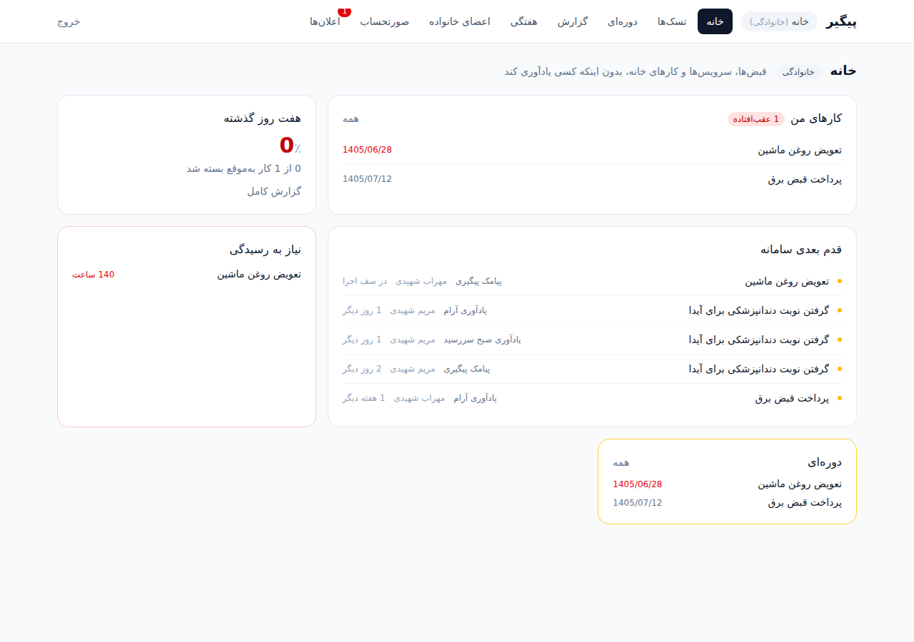
  &nbsp;
  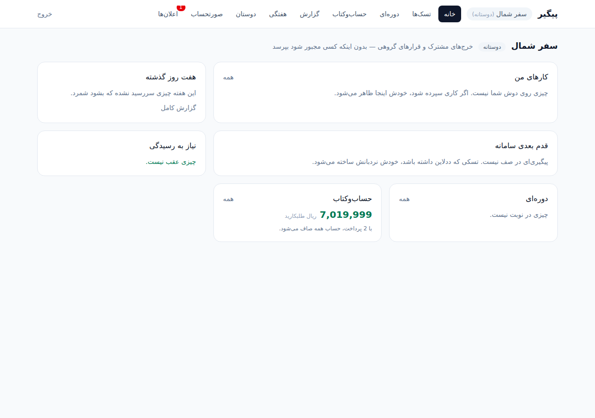
  <br><sub>همان سامانه، دو محصول دیگر: خانواده و گروه دوستانه — بدون تشدید و مالی، با کلمات خودشان</sub>
</p>

### دو چیزی که عمدی‌اند

**ماژول خاموش، ۴۰۴ می‌دهد — نه فقط از منو حذف می‌شود.** لینکی که دیده نمی‌شود
هنوز آدرسی است که یک نفر تایپش می‌کند، یا بعد از عوض‌شدن پلن از بوکمارک بازش
می‌کند. و ۴۰۴ نه ۴۰۳: از نظر یک خانواده آن صفحه اصلاً بخشی از محصول نیست.

**در خانه هیچ‌کس تشدید نمی‌شود.** خانواده خط گزارش‌دهی ندارد. سامانه‌ای که به
همسر کسی پیامک بزند چون سطل زباله هنوز بیرون نرفته، خانه‌ای را که به آن دعوت
شده نفهمیده — و همان پیام است که باعث حذف برنامه می‌شود.

### بیمه و مجوز در پلن خانوادگی

لازم نیست ماژول «قرارداد» باشد: **تمدید سالانه یک تکرار است.** بیمه‌ی شخص
ثالث و سرویس پکیج در «کارهای دوره‌ای» می‌نشینند. اسم‌گذاری‌اش به‌عنوان قرارداد،
لباس شرکت تن خانه کردن است.

### کلمات هم عوض می‌شوند

«اعضا» در شرکت، «اعضای خانواده» در خانه، «دوستان» در جمع دوستانه — و همین‌طور
مدیر / سرپرست / هماهنگ‌کننده.

### نوع کجا انتخاب می‌شود

در همان صفحه‌ی ثبت‌نام، با توضیح پیامد هر گزینه کنارش. اگر کسی عضو چند فضای
کاری باشد، از نوار بالا بینشان جابه‌جا می‌شود — و دمو عمداً دو فضا دارد
(یک شرکت و یک خانه با همان حساب) تا سخت‌ترین چیزی که با حرف توضیح داده
نمی‌شود، با یک کلیک دیده شود.

---

## بخش‌ها و نقش‌ها

<p align="center">
  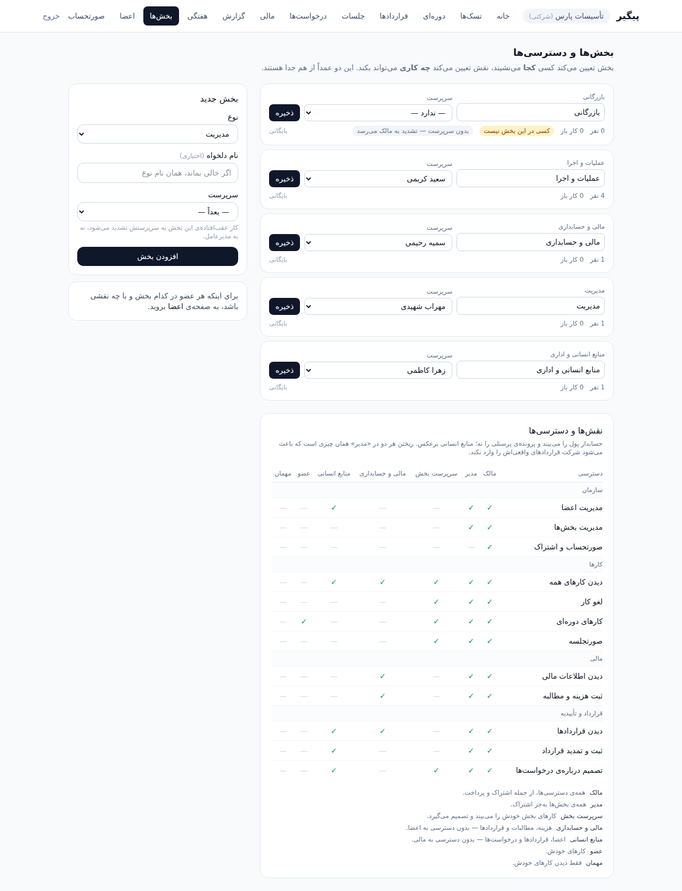
  <br><sub>بخش‌ها، و ماتریس نقش ← دسترسی که از خود کد خوانده می‌شود</sub>
</p>

`/departments` — فقط در پلن شرکتی.

**بخش** تعیین می‌کند کسی *کجا* می‌نشیند؛ **نقش** تعیین می‌کند *چه کاری* می‌تواند
بکند. این دو عمداً از هم جدا هستند: کارآموزِ حسابداری در بخش مالی می‌نشیند و
دفتر مطالبات را نمی‌بیند، و سیستمی که این دو را یکی کند نمی‌تواند این حالتِ
کاملاً عادی را بیان کند.

### جدایی‌ای که کل این نظام برایش ساخته شده

> **حسابدار پول را می‌بیند و پرونده‌ی پرسنلی را نه. منابع انسانی برعکس.**

ریختن هر دو در «مدیر» همان چیزی است که باعث می‌شود شرکت قراردادهای واقعی‌اش را
وارد سامانه نکند.

| نقش | چه می‌بیند |
| --- | --- |
| **مالک** | همه‌چیز، از جمله اشتراک و پرداخت |
| **مدیر** | همه‌ی بخش‌ها به‌جز اشتراک |
| **سرپرست بخش** | کارهای بخشش، لغو کار، تصمیم روی درخواست‌ها |
| **مالی و حسابداری** | هزینه، مطالبات، قراردادها — بدون دسترسی به اعضا |
| **منابع انسانی** | اعضا، قراردادها، درخواست‌ها — بدون دسترسی به مالی |
| **عضو** | کارهای خودش |
| **مهمان** | فقط دیدن کارهای خودش |

جدول کاملش روی خود صفحه چاپ می‌شود، نه در یک متن راهنما — کسی که تصمیم
می‌گیرد چه کسی را با چه چیزی امین بداند، باید **ببیندش**.

### هیچ‌جای کد نمی‌پرسد «این آدم مدیر است؟»

همه‌جا می‌پرسد **«این آدم اجازه‌ی فلان کار را دارد؟»** (`Permission`). سؤال
اول همان است که می‌پوسد: روزی که مشتری حسابداری بخواهد که نتواند عضو اضافه
کند، باید تک‌تک `=== Admin`ها را در کد پیدا و دوباره بحث کرد. سؤال دوم از آن
گفت‌وگو جان سالم به در می‌برد.

**مالکیت از این صفحه واگذار نمی‌شود.** وگرنه یک مدیر خودش را مالک می‌کند و
نگهبانِ اشتراک تزئینی می‌شود.

<p align="center">
  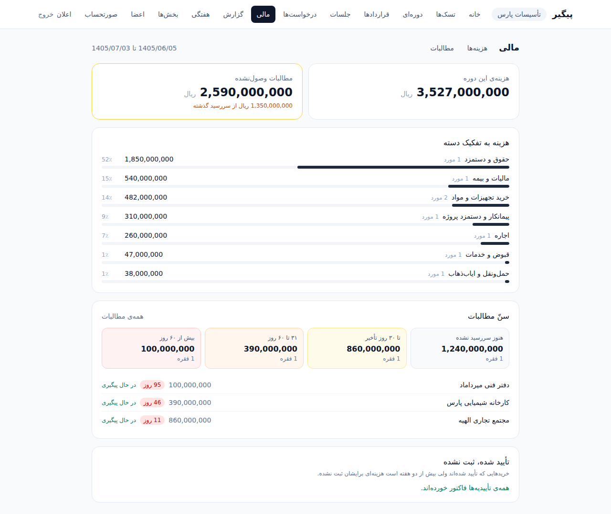
  &nbsp;
  
  <br><sub>نقش «مالی» صفحه‌ی مالی را می‌بیند، اما صفحه‌ی اعضا برایش وجود ندارد</sub>
</p>

### تشدید، به کسی که می‌داند موضوع چیست

ترتیبش این است:

```
مدیر مستقیم  →  سرپرستِ بخشِ خودِ فرد  →  مالک
```

در شرکت چهل‌نفره، پیگیریِ یک سفارش خرید برای **سرپرست بازرگانی** معنا دارد و
برای مدیرعامل هیچ. و سرپرست هرگز درباره‌ی کار خودش تشدید نمی‌گیرد — پیامی به
هیچ‌کس است.

<p align="center">
  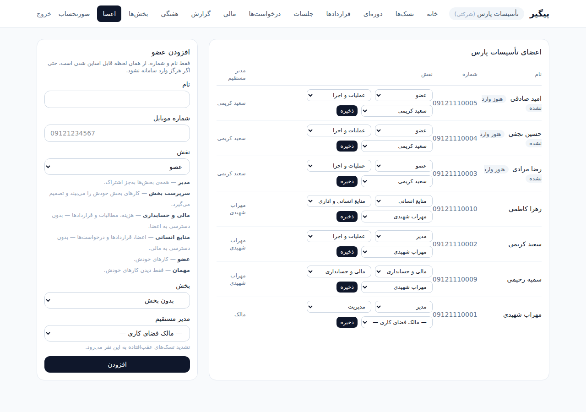
  <br><sub>اعضا، با بخش و نقش هر نفر</sub>
</p>

### بایگانی، نه حذف

بخش بایگانی‌شده اعضایش را نگه می‌دارد و کارهای تمام‌شده برچسبشان را. بخشی که
ناپدید شود، معنای یک سال سابقه را با خودش می‌برد.

---

## داشبورد

`/` — صفحه‌ای که بدون هیچ کلیکی جواب «چه خبر؟» را می‌دهد.

کارت‌هایش بر اساس نوع فضای کاری ساخته می‌شوند، نه بر اساس فیچرها: خانواده‌ای
که اینجا را باز می‌کند نباید کاشی خالیِ «مطالبات» ببیند، چون **کاشی خالی مثل
فیچر خراب به نظر می‌رسد، نه مثل فیچری که ندارند.**

| کارت | چه می‌گوید |
| --- | --- |
| **کارهای من** | اول از همه. مدیر لیست خودش را می‌بیند، تکنسینی هم که فقط پیامک می‌گیرد. |
| **قدم بعدی سامانه** | صف پیگیری‌های بعدی. کل ارزش محصول، به شکل یک فهرست: قرار است چیزهایی بدون شما اتفاق بیفتد. |
| **هفت روز گذشته** | نرخ تکمیل به‌موقع |
| **نیاز به رسیدگی** | عقب‌افتاده، بدون مسئول، و چند بار تأخیرخورده |
| دوره‌ای / قراردادها / پول / درخواست‌ها | فقط اگر پلن دارد |

هیچ عددی که فقط دیتابیس را توصیف کند اینجا نیست — «مجموع تسک‌های تاریخ» صفحه
را شلوغ نشان می‌دهد و به هیچ‌کس کاری نمی‌دهد.

> نرخ هفتگی روی کارهایی شمرده می‌شود که **سررسیدشان** در بازه بوده، نه
> کارهایی که در بازه بسته شده‌اند — وگرنه بستن یک کار قدیمی، نرخ این هفته را
> بالای صد می‌برد.

---

## راه‌اندازی سریع

**راهنمای قدم‌به‌قدم ویندوز با Git Bash (PHP، SQLite، دیتای نمونه، اولاما):
[`docs/local/README.md`](docs/local/README.md)** · برای سرور مجازی:
[`docs/deploy/README.md`](docs/deploy/README.md)

**پیش‌نیازها:** PHP 8.4، Composer، MySQL 8، Node 20 به بالا.

```bash
composer install
npm install && npm run build

cp .env.example .env
php artisan key:generate
```

دیتابیس را بسازید (پایین ببینید)، بعد:

```bash
php artisan migrate
php artisan db:seed --class=DemoSeeder   # اختیاری: دیتای نمونه برای دمو
php artisan serve
```

ورود با شماره **`09121110001`**. روی درایور `log`، کد ورود در
`storage/logs/laravel.log` نوشته می‌شود.

<p align="center">
  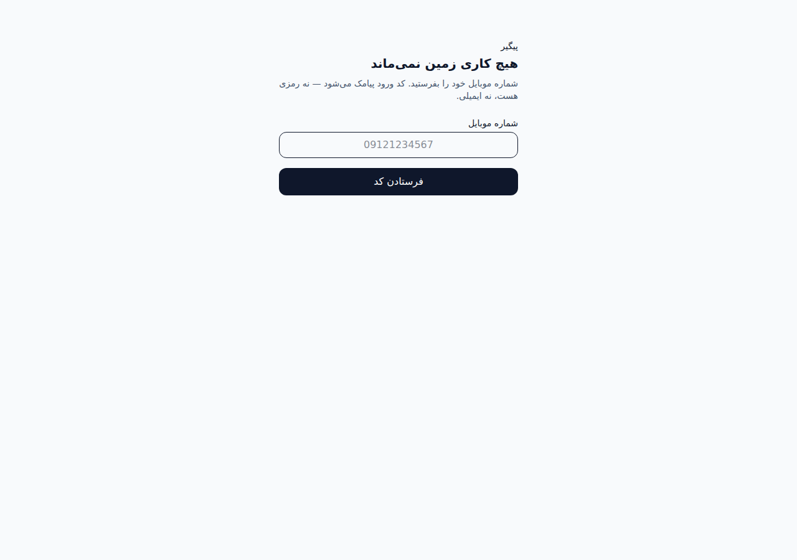
  <br><sub>ورود فقط با شماره موبایل و کد پیامکی — رمز عبوری وجود ندارد</sub>
</p>

### بررسی وضعیت راه‌اندازی

```bash
php artisan app:check            # چه چیزی تنظیم است، چه چیزی بی‌صدا کار نمی‌کند
php artisan app:check --credit   # اعتبار باقی‌مانده را هم از پنل می‌پرسد
```

- <span dir="ltr">✓</span> سبز یعنی تنظیم است
- <span dir="ltr">!</span> زرد یعنی عمداً خاموش است یا فعلاً لازم نیست
- <span dir="ltr">✗</span> قرمز یعنی **بی‌صدا کار نمی‌کند** و باید درست شود

قرمز که باشد، دستور با کد خروج ۱ تمام می‌شود، پس در اسکریپت استقرار قابل
استفاده است. **بعد از هر تغییر در `.env` یک بار اجرایش کنید.**

---

## دیتابیس MySQL

دیتابیس را **قبل از مایگریت** دستی بسازید. `utf8mb4` الزامی است — با کولیشن
پیش‌فرض بعضی نصب‌ها، فارسی و اموجی خراب ذخیره می‌شوند:

```sql
CREATE DATABASE sazmat CHARACTER SET utf8mb4 COLLATE utf8mb4_unicode_ci;
```

در `.env`:

```
DB_CONNECTION=mysql
DB_HOST=127.0.0.1
DB_PORT=3306
DB_DATABASE=sazmat
DB_USERNAME=root
DB_PASSWORD=
```

بعد `php artisan migrate`.

---

## موتور پیگیری

<p align="center">
  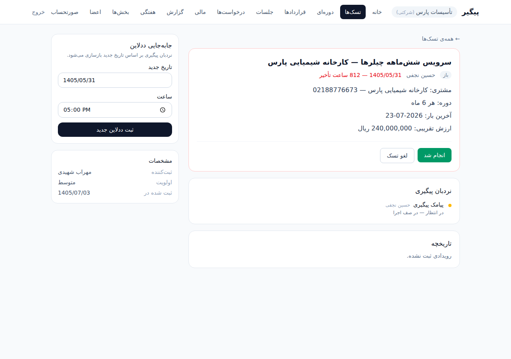
  <br><sub>نردبان پیگیری یک تسک: هر پله، گیرنده‌اش، و اگر نرفت، چرا</sub>
</p>

پنج پله، از آرام تا جدی. **مدیر فقط در پله‌ی چهارم وارد می‌شود.**

| پله | چه وقت | کانال | گیرنده |
| --- | --- | --- | --- |
| ۱ یادآوری آرام | ۲۴ ساعت قبل از ددلاین | اعلان درون‌برنامه‌ای | مجری |
| ۲ یادآوری صبح | ۸:۳۰ روز سررسید | اعلان درون‌برنامه‌ای | مجری |
| ۳ **پیامک پیگیری** | ۲ ساعت بعد از ددلاین | پیامک | مجری |
| ۴ **تشدید** | ۴ ساعت بعد، بدون پاسخ | پیامک | مدیر مستقیم |
| ۵ **گزارش هفتگی** | شنبه ۸:۰۰ | ایمیل + پیامک | مالک و مدیران |

تسک بحرانی نردبان را فشرده می‌کند: پله‌ی ۳ در خود ساعت ددلاین و پله‌ی ۴ بعد از
۹۰ دقیقه.

دو پله‌ی اول رایگان‌اند و در صفحه‌ی **اعلان‌ها** می‌نشینند، با نشانگر
خوانده‌نشده در نوار بالا. همین‌ها هستند که باعث می‌شوند پله‌های پیامکی به‌قدر
کافی کمیاب بمانند تا وقتی می‌آیند جدی گرفته شوند.

**نردبان بعد از پله‌ی ۴ متوقف می‌شود.** پیامک مکرر بعد از تشدید، هم آزاردهنده
است هم بی‌دلیل هزینه بالا می‌برد.

<p align="center">
  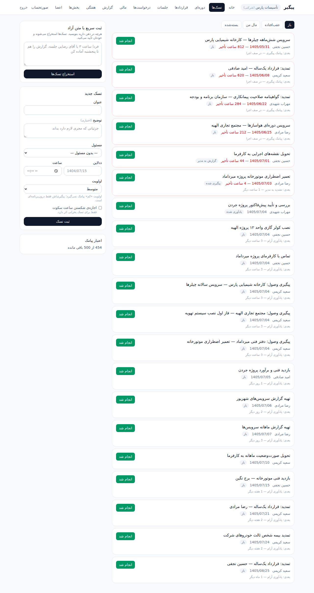
  <br><sub>فهرست تسک‌ها — زیر هر کار نوشته شده سامانه قدم بعدی را کِی برمی‌دارد</sub>
</p>

### قوانین مهار

بدون این‌ها موتور پیگیری یک دستگاه اسپم است و مشتری ماه دوم لغو می‌کند:

| قانون | مقدار پیش‌فرض |
| --- | --- |
| ساعت سکوت | ۲۱:۰۰ تا ۸:۰۰ — پیامک **به تعویق می‌افتد، حذف نمی‌شود** |
| تعطیلات | جمعه و تعطیلات رسمی (جدول `holidays`) |
| سقف هر نفر | ۳ پیامک در روز، ۱۰ در هفته، حداقل ۹۰ دقیقه فاصله |
| کلید خاموشی | یکی برای هر فضای کاری، یکی سراسری در `config/sms.php` |

تسک بحرانی می‌تواند ساعت سکوت را بشکند — **ولی فقط اگر مدیر هنگام ثبت صریحاً
اجازه داده باشد**. اولویت به‌تنهایی رضایت نیست.

### یکتایی

ایندکس یکتا روی `(task_id, step)` در `task_follow_ups`. صف‌ها دوباره اجرا
می‌شوند و زمان‌بندها هم‌پوشانی دارند؛ هیچ دقتی در PHP جلوی ارسال دوباره را
نمی‌گیرد، فقط دیتابیس می‌گیرد.

### پاسخ پیامکی

| کاربر می‌فرستد | نتیجه |
| --- | --- |
| `1` یا `۱` یا «انجام شد» یا «اوکی» | تسک بسته می‌شود |
| `2` یا `۲` یا «تأخیر» | تاریخ جدید پرسیده می‌شود |
| `1405/07/15` یا «فردا» | ددلاین جابه‌جا و نردبان بازسازی می‌شود |
| «لغو» | به مدیر گزارش می‌شود؛ مجری حق لغو ندارد |
| «قطع» | ارسال پیامک برای این نفر متوقف و به مدیر گزارش می‌شود |

<p align="center">
  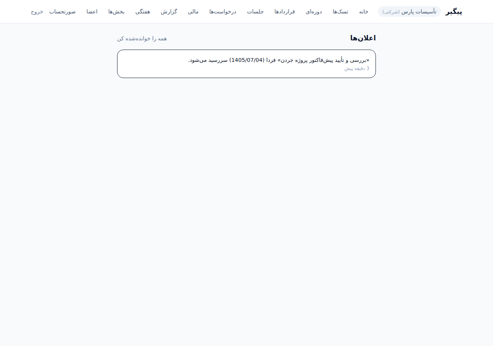
  <br><sub>اعلان‌های درون‌برنامه‌ای</sub>
</p>

---

## پیامک: آموت و خط اختصاصی

خط اختصاصی فقط ارسال مبتنی بر **پترن** را می‌پذیرد؛ متن آزاد رد می‌شود. پس هر
قالب باید در پنل آموت ثبت و تأیید شده باشد و ما فقط کد پترن و مقادیرش را
می‌فرستیم.

**۱۲ پترن لازم است.** متن هرکدام در `config/sms.php` است و همان را عیناً در پنل
ثبت کنید:

> ⚠️ **متغیرهای آموت با درصد نوشته می‌شوند، نه آکولاد:** `%name%`، نه `{name}`.
> مقادیر به‌صورت **یک فهرست ترتیبی** فرستاده می‌شوند، پس ترتیب متغیرها در متن پنل
> باید همان ترتیب ستون سوم باشد. اگر پنل متنی را اصلاح خواست، کلمات را عوض کنید
> ولی متغیرها و ترتیبشان را نه؛ متن نهایی را در `config/sms.php` هم بگذارید.
> `SmsPatternRegistryTest` اگر آکولاد یا ترتیب اشتباه ببیند، تست را قرمز می‌کند.

| پترن | متن برای پنل | ترتیب متغیرها | کد در ‎.env |
| --- | --- | --- | --- |
| `chase` | <code>%name%، سررسید: %title%<br>۱=انجام شد ۲=تأخیر<br>همین پیامک را پاسخ دهید</code> | ۱. `name`، ۲. `title` | `AMOOT_PATTERN_CHASE` |
| `defer_ask` | <code>تاریخ جدید را بفرستید<br>مثال: 1404/07/15</code> | — | `AMOOT_PATTERN_DEFER_ASK` |
| `escalate` | <code>%title%<br>مسئول: %name% - بدون پاسخ<br>تأخیر: %hours% ساعت</code> | ۱. `title`، ۲. `name`، ۳. `hours` | `AMOOT_PATTERN_ESCALATE` |
| `confirm_done` | <code>ثبت شد. ممنون %name%</code> | ۱. `name` | `AMOOT_PATTERN_CONFIRM_DONE` |
| `confirm_defer` | <code>تاریخ جدید ثبت شد: %date%</code> | ۱. `date` | `AMOOT_PATTERN_CONFIRM_DEFER` |
| `unknown` | <code>متوجه نشدم. ۱=انجام شد ۲=تأخیر</code> | — | `AMOOT_PATTERN_UNKNOWN` |
| `otp` | <code>کد ورود: %code%<br>تا ۲ دقیقه معتبر است</code> | ۱. `code` | `AMOOT_PATTERN_OTP` |
| `welcome` | <code>%name% عزیز، به %workspace% اضافه شدید</code> | ۱. `name`، ۲. `workspace` | `AMOOT_PATTERN_WELCOME` |
| `subscription_expiring` | <code>اشتراک %plan% تا %days% روز دیگر تمام می‌شود<br>برای تمدید وارد پنل شوید</code> | ۱. `plan`، ۲. `days` | `AMOOT_PATTERN_SUBSCRIPTION_EXPIRING` |
| `approval_request` | <code>درخواست %type% از %name%<br>%title%<br>منتظر تأیید شماست</code> | ۱. `type`، ۲. `name`، ۳. `title` | `AMOOT_PATTERN_APPROVAL_REQUEST` |
| `approval_decision` | <code>درخواست شما %result% شد<br>%title%</code> | ۱. `result`، ۲. `title` | `AMOOT_PATTERN_APPROVAL_DECISION` |
| `weekly_report` | <code>گزارش هفته آماده است<br>تکمیل به‌موقع: %rate%٪<br>عقب‌افتاده: %overdue%</code> | ۱. `rate`، ۲. `overdue` | `AMOOT_PATTERN_WEEKLY_REPORT` |

`<br>` یعنی خط جدید؛ در پنل Enter بزنید. `٪` در `weekly_report` علامت درصد فارسی
است و بخشی از متن است، نه متغیر.

> هر متن زیر **۷۰ کاراکتر** نوشته شده، چون پیامک فارسی با UCS-2 می‌رود: ۷۰
> کاراکتر در یک پیامک و ۶۷ کاراکتر در هر بخش پیامک چندبخشی. یک کاراکتر اضافه،
> هزینه را دو برابر می‌کند.

### لازم نیست همه را یک‌جا ثبت کنید

پترنی که کدش در `.env` نباشد، **قبل از رفتن به سمت پنل رد می‌شود** و موتور
آن را یک پیام تحویل‌نشده حساب می‌کند، نه یک موفقیت خاموش. پس می‌توانید
پله‌پله جلو بروید:

| مرحله | پترن‌های لازم | بدونشان چه از کار می‌افتد |
| --- | --- | --- |
| **۱. ورود** | `otp` | هیچ‌کس نمی‌تواند وارد شود. **این تنها پترن واقعاً اجباری است.** |
| **۲. موتور پیگیری** | `chase` · `escalate` · `defer_ask` · `confirm_done` · `confirm_defer` · `unknown` | پیگیری پیامکی و پاسخ دوطرفه. پله‌های اول (اعلان درون‌برنامه) همچنان کار می‌کنند. |
| **۳. بقیه** | `welcome` · `weekly_report` · `subscription_expiring` · `approval_request` · `approval_decision` | فقط همان یک قابلیت پیامکش نمی‌رود؛ خودش در سامانه کار می‌کند. |

یعنی برای اینکه **همین امروز** روی خط واقعی بالا بیاید و کسی بتواند وارد شود،
فقط `otp` را ثبت کنید و کدش را در `AMOOT_PATTERN_OTP` بگذارید. بقیه هر وقت
تأیید شدند اضافه می‌شوند.

> اگر پنل پترن ورود را رد کند یا اعتبار تمام شده باشد، صفحه‌ی ورود صریحاً
> می‌گوید «پیامک ارسال نشد» و خطای پنل در لاگ می‌نشیند — کاربر روی صفحه‌ی
> کد با دست خالی رها نمی‌شود.

### وب‌هوک پیامک ورودی

```
POST /api/webhooks/sms/amoot/{هر-رشته-تصادفی}
هدر: X-Webhook-Secret: <AMOOT_INBOUND_SECRET>
```

مسیر غیرقابل‌حدس است، ولی لو رفتن مسیر نباید برای تزریق پاسخ به تسک‌های دیگران
کافی باشد — برای همین رمز مشترک هم چک می‌شود. رمز را این‌طور بسازید:

```bash
php -r "echo bin2hex(random_bytes(24));"
```

> ⚠️ **قبل از اولین ارسال واقعی:** نام دقیق پارامترهای `SendWithPattern` و شکل
> پاسخ آن بین نسخه‌های پنل فرق می‌کند. از مستندات پنل خودتان بررسی کنید و در
> صورت نیاز فقط `payloadFor()` و `interpret()` در
> `app/Sms/Drivers/AmootSmsDriver.php` را تنظیم کنید. بقیه‌ی موتور از این
> فرمت جدا نگه داشته شده است.

### درایورها

| درایور | کاربرد |
| --- | --- |
| `log` | توسعه‌ی محلی. پیامک در لاگ نوشته می‌شود، اعتباری خرج نمی‌شود. |
| `fake` | تست‌ها. در حافظه ثبت می‌شود. |
| `amoot` | تولید. **تا وقتی پترن تأیید نشده روی این نروید.** |

### برآورد مصرف

برای یک شرکت ۲۰ نفره با روزی ۳ تسک به‌ازای هر نفر، اگر ۲۰٪ تسک‌ها به پله‌ی ۳
برسند: **ماهانه حدود ۴۰۰ تا ۴۵۰ پیامک**. این عدد باید در قیمت پلن دیده شود.

---

## گزارش هفتگی خودکار

<p align="center">
  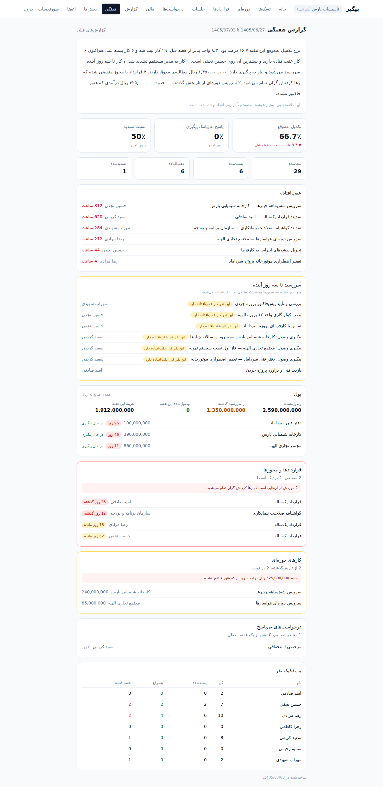
  <br><sub>گزارش هفتگی — هر شنبه صبح، خودش نوشته و فرستاده می‌شود</sub>
</p>

پله‌ی پنجم نردبان، و تنها چیزی که مدیرعامل می‌بیند — یعنی همان چیزی که اشتراک
را تمدید می‌کند.

### چه چیزی می‌فرستد

- **یک پاراگراف فارسی** در بالای گزارش که با مهم‌ترین نکته شروع می‌شود
- **سه عدد کلیدی** همراه با **تغییر نسبت به هفته‌ی قبل** (▲ / ▼)
- **کارهای عقب‌افتاده** با نام مسئول و ساعت تأخیر
- **سررسید تا سه روز آینده** — هنوز دیر نشده، و کسی که همین حالا کار عقب‌افتاده
  دارد علامت می‌خورد
- **تفکیک نفربه‌نفر**

### همه‌ی موتورها در یک گزارش

گزارش هفتگی تنها چیزی است که مدیرعامل می‌خواند، پس هرچه سامانه می‌داند باید
در همین یک ایمیل باشد — نه فقط شمارش تسک‌ها:

| بخش | چه می‌گوید | فقط اگر پلن دارد |
| --- | --- | :---: |
| **پول** | وصول‌نشده، معوق، وصول‌شده‌ی این هفته، هزینه — و **چند فقره‌ی معوق که هنوز هیچ‌کس پیگیرش نیست** | مالی |
| **قرارداد و مجوز** | منقضی‌شده‌ها، و جدا از آن‌ها: چندتاشان از آن‌هایی است که رها کردنش گران است | قراردادها |
| **کار دوره‌ای** | سرویس‌های عقب‌افتاده و **درآمدی که هنوز فاکتور نشده** | دوره‌ای |
| **درخواست‌های معطل** | بی‌پاسخ‌ها، و آن‌هایی که بیش از یک هفته منتظرند | تأییدیه |
| **حساب‌وکتاب** | تسویه‌نشده، و اینکه با چند پرداخت حساب همه صاف می‌شود | دوستانه |

**بخشی که پلن ندارد، اصلاً در snapshot نیست — نه اینکه صفر باشد.** خانواده‌ای
که هر هفته بخش «مطالبات» دریافت کند، گزارشِ یک نفر دیگر را گرفته است. و مدل
هم این اعداد را اصلاً نمی‌بیند، وگرنه درباره‌شان جمله می‌نویسد.

پاراگراف بالای گزارش هم به ترتیب هزینه مرتب است: **اول پولی که کسی پیگیرش
نیست**، بعد مجوزی که منقضی شده، بعد درآمد روی زمین‌مانده، بعد آدم‌هایی که
منتظر تصمیم‌اند. شمارش تسک‌ها بعد از این‌ها می‌آید.

### دو تصمیم مهم

**۱. عددها منجمد می‌شوند.** گزارش یک بار ساخته و ذخیره می‌شود و هرگز دوباره
محاسبه نمی‌شود. مدیری که شنبه «۷۱٪» خوانده و سه‌شنبه عدد دیگری می‌بیند، دیگر به
گزارش اعتماد نمی‌کند.

**۲. ایمیل به‌تنهایی کافی نیست.** تحویل ایمیل به اینباکس‌های ایرانی آن‌قدر
غیرقابل‌اتکاست که گزارشی که فقط در ایمیل زندگی می‌کند، گزارشی است که نصف
مشتری‌ها هرگز نمی‌خوانند. پس:

- گزارش **آدرس دائمی** خودش را دارد (`/reports/weekly/{token}`)
- یک **پیامک** سرتیتر و لینک را می‌برد
- اگر ایمیل شکست بخورد، پیامک همچنان می‌رود

<p align="center">
  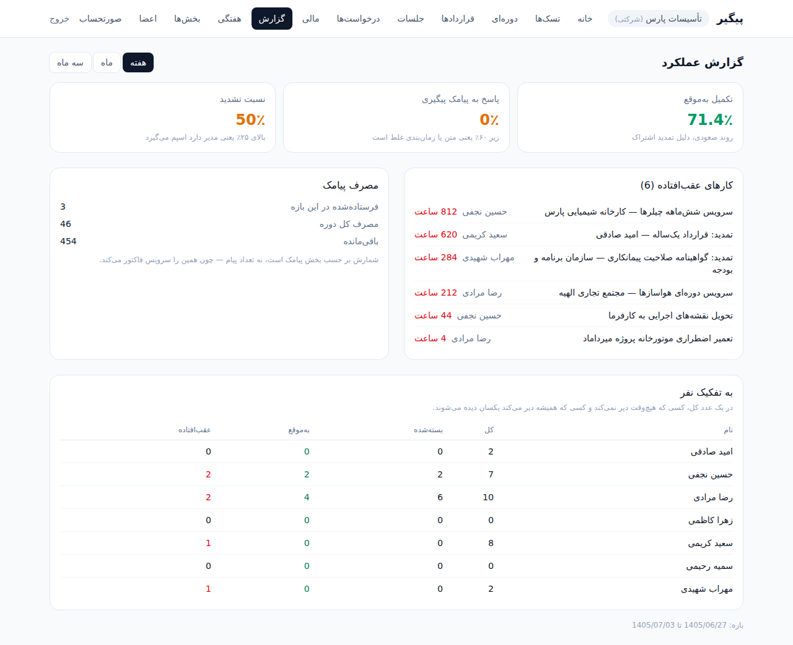
  <br><sub>صفحه‌ی گزارش: کارنامه‌ی هر نفر و کارهای عقب‌افتاده</sub>
</p>

### زمان‌بندی

دستور **ساعتی** اجرا می‌شود، نه هفتگی:

```bash
php artisan reports:weekly
```

«شنبه ساعت ۸» برای هر فضای کاری یک لحظه‌ی متفاوت است و یک عبارت کرون فقط
می‌تواند برای یک منطقه‌ی زمانی درست باشد. پس هر ساعت از هر فضای کاری پرسیده
می‌شود که آیا صبح خودش رسیده یا نه. ایندکس یکتا روی
`(workspace_id, period_start)` پرسیدن دوباره را بی‌ضرر می‌کند.

تنظیم روز و ساعت در `config/followup.php` یا per-workspace در
`workspaces.settings`:

```php
'report' => [
    'day_of_week' => 6,  // Carbon: 0 یکشنبه، 6 شنبه
    'hour' => 8,
],
```

برای تست دستی:

```bash
php artisan reports:weekly --workspace=1   # بدون توجه به زمان‌بندی
```

---

## هوش مصنوعی لوکال با اولاما

مدل روی **سرور خودتان** اجرا می‌شود. این همان چیزی است که اجازه می‌دهد به بانک،
بیمه و پیمانکار دولتی بگویید: **«دیتای شما از سرور شما خارج نمی‌شود.»** هیچ
رقیب متکی به سرویس خارجی نمی‌تواند این جمله را بگوید.

### نصب روی سرور مجازی

```bash
curl -fsSL https://ollama.com/install.sh | sh
ollama pull qwen2.5:7b-instruct
```

### کدام مدل

دو کار متفاوت داریم و هرکدام نیاز متفاوتی دارد:

| کار | چه می‌خواهد | مدل پیشنهادی | حداقل RAM |
| --- | --- | --- | --- |
| **استخراج تسک از متن** | پیروی دقیق از JSON Schema و سرعت | `qwen2.5:7b-instruct` | ۸ گیگ |
| **نوشتن خلاصه‌ی گزارش** | فارسی روان و خوانا | `qwen2.5:14b-instruct` | ۱۶ گیگ |

**روی VPS کوچک هر دو را یکی بگذارید** — چیزی خراب نمی‌شود:

```
OLLAMA_MODEL_EXTRACTION=qwen2.5:7b-instruct
OLLAMA_MODEL_WRITING=qwen2.5:7b-instruct
```

گزینه‌های دیگر که ارزش تست دارند: `gemma2:9b` و `aya-expanse:8b` (این یکی
چندزبانه و برای فارسی خوب است). اگر سرور GPU ندارد، زیر ۷B نروید — کیفیت فارسی
به‌شدت افت می‌کند.

> **قبل از انتخاب نهایی، با ۲۰ جمله‌ی واقعی از مشتری‌های خودتان تست کنید.**
> مدلی که انگلیسی را تمیز می‌فهمد ممکن است نام فارسی، نیم‌فاصله و تاریخ شمسی را
> خراب کند — و دقیقاً همین‌ها چیزی است که این برنامه به مدل می‌دهد.

### اسم مدل‌ها کجا می‌رود

دو جا، و فقط همین دو جا:

**۱. در `.env`** (مقدار واقعی):

```
AI_PROVIDER=ollama
OLLAMA_BASE_URL=http://127.0.0.1:11434
OLLAMA_MODEL_EXTRACTION=qwen2.5:7b-instruct
OLLAMA_MODEL_WRITING=qwen2.5:14b-instruct
OLLAMA_TIMEOUT=120
OLLAMA_KEEP_ALIVE=30m
```

**۲. در `config/ai.php`** (مقدار پیش‌فرض، اگر `.env` خالی بود). هیچ‌جای دیگری
در کد اسم مدل نوشته نشده.

### چه کاری می‌کند

| کاربرد | وضعیت |
| --- | --- |
| متن آزاد ← تسک ساختاریافته | ✅ پیاده شده |
| نوشتن خلاصه‌ی گزارش هفتگی | ✅ پیاده شده |
| صورتجلسه ← خلاصه، تصمیم‌ها و اقدامات | ✅ پیاده شده |
| متن آزاد ← هزینه‌ی ساختاریافته | ✅ پیاده شده |
| هشدار ریسک پروژه | فاز بعد |

### خروجی مدل هرگز مستقیم پذیرفته نمی‌شود

- با **JSON Schema** محدود می‌شود
- با **اعتبارسنج لاراول** بررسی می‌شود
- نام‌ها با **اعضای واقعی** تطبیق داده می‌شوند؛ نام ساختگی به هیچ‌کس اساین نمی‌شود
- تاریخ‌ها در **بازه‌ی منطقی** محدود می‌شوند (نه گذشته، نه دو سال آینده)
- خلاصه‌ی خیلی کوتاه یا خیلی بلند **رد می‌شود**

### اگر مدل نباشد چه می‌شود

**هیچ‌چیز خراب نمی‌شود.** `AI_PROVIDER=null` بگذارید و:

- ثبت سریع با متن آزاد به فرم دستی برمی‌گردد و صریح می‌گوید که دستیار در دسترس نیست
- گزارش هفتگی خلاصه را **مستقیماً از روی اعداد** می‌نویسد، با فارسی روان و
  اعداد فارسی
- صورتجلسه ذخیره می‌شود و متن خامش می‌ماند؛ هر وقت مدل آمد، دکمه‌ی
  «استخراج دوباره» همان متن را دوباره می‌خواند

هوش مصنوعی **میانبر است، نه دروازه**.

---

## صورتجلسه ← اقدامات

<p align="center">
  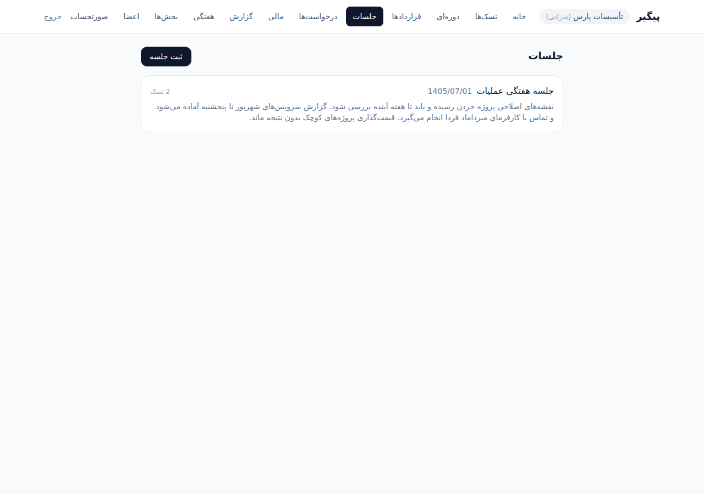
  <br><sub>جلسه‌ها؛ هر مصوبه‌ی دارای مسئول و تاریخ، تسکی است که پیگیری می‌شود</sub>
</p>

`/meetings`

متن جلسه را همان‌طور که هست می‌چسبانید. مدل سه چیز بیرون می‌کشد: **خلاصه**،
**تصمیم‌ها**، و **اقدام‌ها**. هر اقدام یک پیش‌نویس است تا مدیر تأییدش کند؛ تسکی
بدون تأیید ساخته نمی‌شود.

**فقط مالک، مدیر و سرپرست بخش جلسه‌ها را می‌بینند.** صورتجلسه حرف‌هایی درباره‌ی
مشتری، قیمت و آدم‌ها دارد. بقیه نتیجه را به شکل تسکی می‌بینند که به آن‌ها سپرده
شده، بدون اسم و لینک جلسه.

### قاعده‌ای که این بخش رویش ساخته شده

> **فقط چیزی «اقدام» است که کسی صریحاً قبولش کرده باشد.**

«باید یک فکری بکنیم» و «خوب است بررسی شود» اقدام نیستند. اگر این قاعده نباشد،
مدل از دل یک بحث نیم‌ساعته ده تا تسک می‌سازد و موتور پیگیری شروع می‌کند به
پیامک‌زدن بابت کاری که هیچ‌کس قبولش نکرده — و همان‌جا مشتری را از دست می‌دهید.
یک اقدام جاافتاده خیلی بهتر از یک اقدام ساختگی است.

### چه چیزی محافظت می‌شود

- نام مسئول با **اعضای واقعی** تطبیق داده می‌شود؛ نام ساختگی بدون مسئول می‌ماند
- تاریخ در بازه‌ی منطقی محدود می‌شود (نه گذشته، نه دو سال آینده)
- حداکثر **۱۵ اقدام** از یک متن؛ بیشتر از آن یعنی مدل متن را بد خوانده
- خلاصه‌ی زیر ۳۰ یا بالای ۱۲۰۰ کاراکتر رد می‌شود
- **متن خام هرگز دور ریخته نمی‌شود** — هم برای بازپخش قواعد، هم چون آرشیو
  تصمیم‌های شش‌ماه‌پیش خودش دلیل ماندن مشتری است

تسکی که از جلسه ساخته شود `meeting_id` می‌گیرد، پس ماه‌ها بعد جواب «این از کجا
آمد؟» یک کلیک فاصله دارد.

---

## گردش کار تأییدیه

<p align="center">
  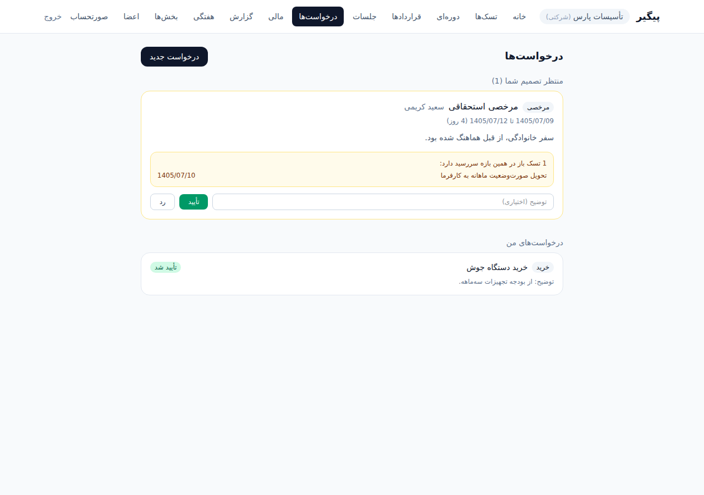
  <br><sub>درخواست مرخصی، همراه با کارهایی که در آن بازه روی زمین می‌مانند</sub>
</p>

`/approvals`

مرخصی، خرید و هزینه. درخواست به **مدیر مستقیم** فرد می‌رود (`manager_id` روی
`workspace_user`)؛ اگر مدیری ثبت نشده باشد، به مالک و مدیران فضای کاری می‌رسد.
درخواستی که منتظر آدمی باشد که وجود ندارد، برای همیشه منتظر می‌ماند.

### چیزی که این بخش را از یک فرم ساده جدا می‌کند

**مرخصی تأییدشده به موتور پیگیری وصل است.** تأیید که شد، `away_until` روی عضویت
نوشته می‌شود و دروازه‌ی مهار با دلیل `recipient_away` هیچ پیامکی برایش نمی‌فرستد.

شرکتی که برگه‌ی مرخصی کسی را خودش امضا کرده و روز دوم برایش «چرا انجام نشد؟»
می‌فرستد، به تیمش یاد داده پیامک‌های سامانه را نادیده بگیرد — و موتور پیگیری،
خودِ محصول است.

### دو تصمیم عمدی

**قبل از تصمیم، تعارض‌ها نشان داده می‌شود.** «مرخصی سه روزه» به‌تنهایی تصمیم‌گرفتنی
نیست؛ «مرخصی سه روزه، و این دو تسک سررسیدشان داخل همان بازه است» هست. صفحه‌ی
تأیید، تسک‌های باز همان بازه را زیر درخواست می‌آورد.

**هیچ‌کس درخواست خودش را تأیید نمی‌کند**، حتی مالک. مالکی که مرخصی خودش را امضا
کند، رکوردی ساخته که هیچ‌کس باورش نمی‌کند — و اعتبار همین رکوردهاست که فروخته
می‌شود.

**مرخصی کوتاه، مرخصی بلندِ در جریان را کوتاه نمی‌کند.** `away_until` فقط جلو
می‌رود، هرگز عقب نمی‌آید.

---

## حساب‌وکتاب دوستانه

<p align="center">
  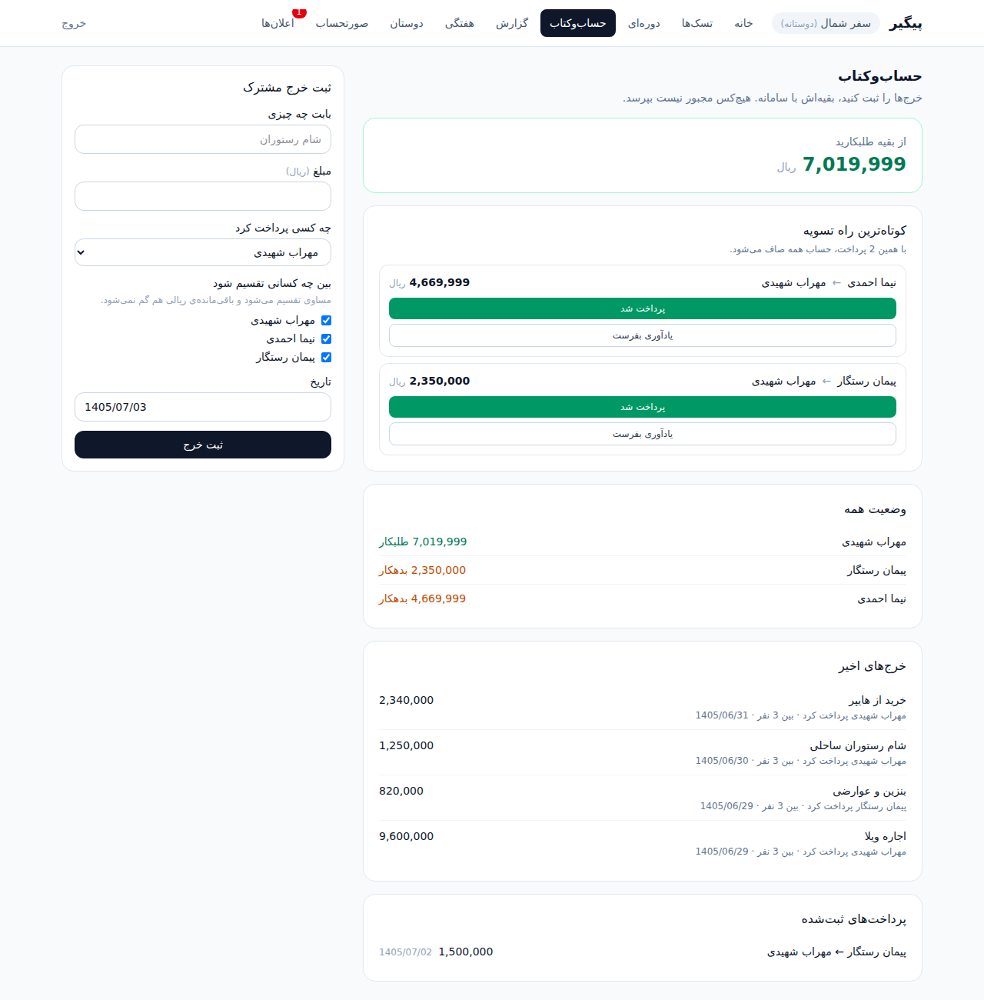
  <br><sub>مانده‌ی هر نفر و کوتاه‌ترین راه تسویه — کی به کی چقدر بدهد</sub>
</p>

`/settlements` — فقط در پلن دوستانه.

این تنها ماژولی است که پلن دوستانه را **پلن** می‌کند. درد یک جمع دوستانه
کارهای خانه نیست؛ همان سؤال بعد از هر سفر و هر شام است — و اینکه **هیچ‌کس
دوست ندارد آن کسی باشد که می‌پرسد**.

### چیزی که می‌فروشد: جواب، نه داده

شش نفر بعد از یک سفر در پانزده بدهی کوچک به هم گره خورده‌اند. هیچ‌کس این گره
را باز نمی‌کند، پس هیچ‌کس پرداخت نمی‌کند. کاری که این صفحه می‌کند تبدیل آن به
این است:

> **رضا به حسین ۴۲۰,۰۰۰ بدهد. تمام.**

الگوریتمش حریصانه است: بزرگ‌ترین بدهکار به بزرگ‌ترین طلبکار. اثباتاً کمینه
نیست (آن مسئله NP-hard است) ولی **هرگز از «تعداد نفرات منهای یک» بیشتر
نمی‌شود** — و همین فرق بین فهرستی است که کسی اجرایش می‌کند و گره‌ای که نادیده
گرفته می‌شود.

### قاعده‌ای که کل ماژول رویش ایستاده

**هیچ ریالی گم نمی‌شود.**

ریال واحد خردتر ندارد. ۱۰,۰۰۰ تقسیم بر سه می‌شود ۳,۳۳۳ و یک ریال که جایی
ندارد. اگر آن یک ریال دور ریخته شود، سهم‌ها دیگر با مبلغ پرداختی برابر
نیستند، هر خرج کمی نشت می‌کند، و **موجودی‌ها هرگز به صفر نمی‌رسند** — جمعی که
هیچ‌وقت نمی‌تواند تسویه را تمام کند، دیگر به هیچ عددی اعتماد نمی‌کند.

پس باقی‌مانده **پخش می‌شود**، یک ریال یک ریال، با ترتیب ثابت. ترتیبش فقط از
این جهت مهم است که **پایدار** باشد: محاسبه‌ی دوباره‌ی همان تقسیم باید همان
جواب را بدهد، وگرنه یک ویرایش، یک ریال را بین دو دوست جابه‌جا می‌کند بی‌آنکه
هیچ‌کدام بفهمند چرا.

تست‌ها همین یک چیز را از چند طرف محاصره می‌کنند، از جمله: **جمع خالص همه
همیشه صفر است**، هر طور که پول جابه‌جا شده باشد.

### یادآوری، با دکمه — نه با کرون

بدهی‌ای که مانده، با یک دکمه تبدیل به **تسک** می‌شود و از آن به بعد خودِ موتور
پیگیری‌اش می‌کند — اعلان، بعد پیامک.

ولی شروعش دست آدم است، عمداً:

> موتوری که فاکتور پرداخت‌نشده‌ی یک شرکت را پیگیری می‌کند، دارد کارش را
> می‌کند. همان موتور اگر **بی‌اجازه** به دوست کسی درباره‌ی پول شام پیامک
> بزند، محصولی است که کسی نگهش نمی‌دارد.

و دکمه‌اش فقط به **طلبکار** نشان داده می‌شود؛ کسی نباید بتواند موتور را به
اسم شخص ثالثی روی دوستش راه بیندازد.

### محافظ‌ها

- پرداختِ **بیشتر از بدهی** رد می‌شود — عدد اشتباه نباید طلبی بسازد که بعداً سرش بحث شود
- بین دو نفری که صاف‌اند، پرداخت ثبت نمی‌شود
- کسی به خودش پرداخت نمی‌کند
- یادآوری دوم روی یادآوری بازِ قبلی انباشته نمی‌شود

---

## کارهای دوره‌ای

<p align="center">
  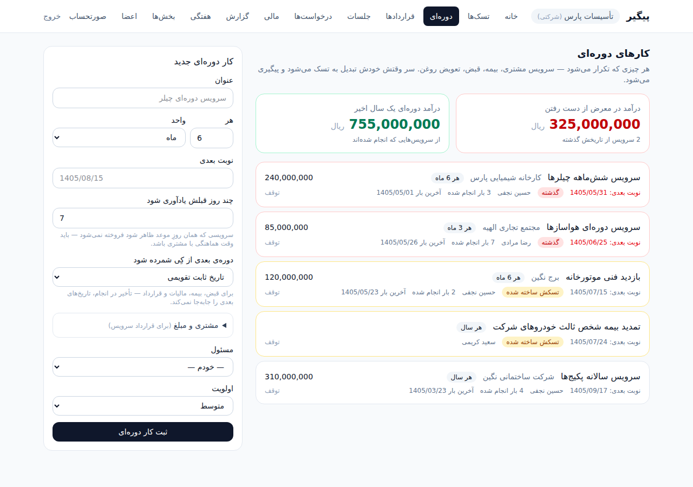
  <br><sub>کارهای دوره‌ای شرکت، با جمع درآمدی که به تمدیدشان بسته است</sub>
</p>

`/recurring`

هر چیزی که تکرار می‌شود و ممکن است زمین بماند: سرویس شش‌ماهه‌ی مشتری، بیمه‌ی
ماشین، مالیات فصلی، تعویض روغن. سر وقتش **خودش تبدیل به تسک می‌شود** و وارد
همان نردبان پیگیری می‌شود.

### چرا این ماژول برای شرکت پول می‌سازد

بقیه‌ی بخش‌ها هزینه را **گزارش** می‌کنند؛ این یکی **درآمد** می‌سازد.

سرویس شش‌ماهه فقط وقتی فاکتور می‌شود که کسی یادش بیفتد به مشتری زنگ بزند — پس
بیشترشان هرگز فاکتور نمی‌شوند. قرارداد هست، درآمدش نیست. اینجا یادآوری یک
ردیف در تقویمی نیست که کسی بازش نمی‌کند: **تبدیل به تسک می‌شود، یعنی کسی
واقعاً پیگیرش است.**

و صفحه‌اش دو عدد دارد که همان استدلال فروش‌اند، به ارز خودِ مشتری:

| عدد | چه می‌گوید |
| --- | --- |
| **درآمد در معرض از دست رفتن** | جمع ارزش سرویس‌هایی که تاریخشان گذشته. یعنی این‌قدر پول همین حالا روی زمین مانده. |
| **درآمد دوره‌ای یک سال اخیر** | جمع سرویس‌هایی که انجام شده‌اند. یعنی اشتراک خودش را درآورد یا نه. |

اگر هیچ مبلغی ثبت نشده باشد — مثل پلن خانوادگی که کسی روی تعویض روغن قیمت
نمی‌گذارد — این دو کاشی **اصلاً نشان داده نمی‌شوند**، به‌جای اینکه صفر نشان
بدهند و خراب به نظر برسند.

### همین موتور، برای خانواده

<p align="center">
  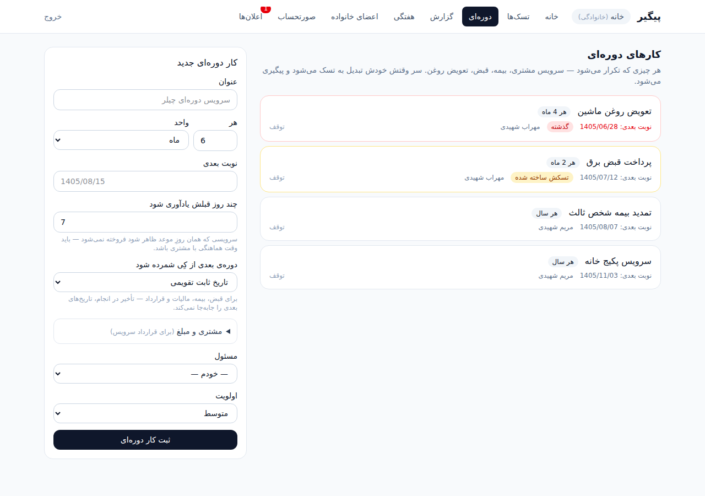
  <br><sub>همان موتور، در پلن خانوادگی</sub>
</p>

همان جدول، بدون نام مشتری و بدون مبلغ: بیمه، قبض، سرویس ماشین، تمدید گواهینامه.
مکانیزم یکی است — چیزی که تاریخ دارد و برمی‌گردد — فقط کلمات روی صفحه فرق
می‌کنند. برای همین یک جدول است و یک موتور، نه دوتا.

### پیش‌آگاهی

`lead_days` تعیین می‌کند چند روز **قبل از** موعد، تسک ساخته شود.

> **سرویسی که همان روزِ موعد ظاهر شود، فروخته نمی‌شود.** باید وقت باشد که کسی
> به مشتری زنگ بزند و تاریخ هماهنگ کند. پیش‌فرض ۷ روز است.

پیش‌آگاهیِ بلندتر از خودِ دوره رد می‌شود، چون نوبت بعدی را قبل از تمام شدن
نوبت فعلی می‌ساخت — تا ابد.

### دوره‌ی بعدی از کجا شمرده می‌شود

این تصمیم تا ماه‌ها بعد نامرئی است و اشتباهش گران:

| حالت | برای چه | چرا |
| --- | --- | --- |
| **تاریخ ثابت تقویمی** | قبض، بیمه، مالیات، قرارداد | قبضی که سه روز دیر پرداخت شود نباید تمام قبض‌های آینده را سه روز جلو ببرد، و باز هم، و باز هم. |
| **از زمان انجام واقعی** | سرویس و نگهداری | چیلری که دو ماه دیر سرویس شود، شش ماه از **سرویس** فرصت می‌خواهد، نه چهار ماه. |

دو محافظ دیگر:

- **انجام زودتر، دوره را کوتاه نمی‌کند** — از دیرترینِ (موعد، زمان انجام) شمرده می‌شود.
- **کار دو سال رهاشده، در گذشته نمی‌افتد** — آن‌قدر جلو می‌رود تا نوبت بعدی واقعاً در آینده باشد، وگرنه هر شب یک تسک تازه می‌ساخت.

### یک تسک در هر لحظه

بدون این محافظ، جارو از روز پیش‌آگاهی تا روز موعد **هر شب یک کپی تازه**
می‌ساخت: هفت تسک یکسان برای یک سرویس، و گیرنده‌ای که دیگر هیچ‌کدام را
نمی‌خواند.

### پیشروی دوره، هرجا که تسک بسته شود

پیشروی روی **observer مدل** نشسته، نه در کنترلر. تسک ممکن است از فرم بسته شود،
با پاسخ پیامکی، یا از مسیری که فردا اضافه می‌شود — و دوره باید در هر سه حالت
جلو برود، نه در دوتایی که کسی یادش مانده.

**لغو، انجام حساب نمی‌شود.** فقط `Done` دوره را جلو می‌برد.

```bash
php artisan recurrences:run --dry
php artisan contracts:watch --dry
php artisan recurrences:run
```

روی کرون، هر روز ساعت ۷:۳۰.

---

## قراردادها و مجوزها

<p align="center">
  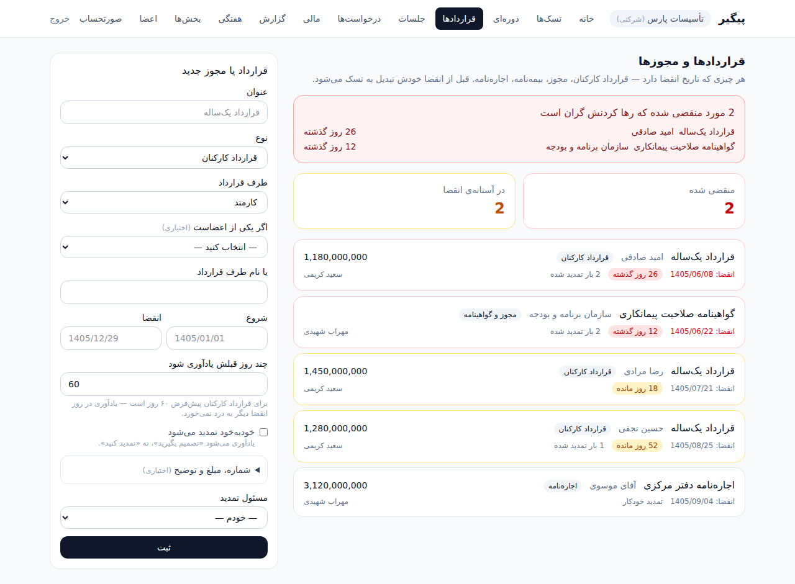
  <br><sub>قراردادها و مجوزها، با اخطار پیش از انقضا</sub>
</p>

`/contracts`

هر چیزی که تاریخ انقضا دارد: قرارداد کارکنان، صلاحیت پیمانکاری، بیمه‌نامه،
اجاره‌نامه. قبل از انقضا خودش تبدیل به تسک می‌شود.

### چرا این با «کار دوره‌ای» یکی نیست

عمداً جدا نگه داشته شده. **کار دوره‌ای** روی یک ریتم ثابت تکرار می‌شود و
«انجامش» یعنی همان کار را دوباره کردن. **قرارداد** طرف مقابل دارد و یک دوره —
و تمدیدش یعنی توافق بر سر دوره‌ی **جدیدی که طولش را از قبل نمی‌دانید**:
قراردادی که این بار شش‌ماهه تمدید می‌شود و دفعه‌ی بعد یک‌ساله، حالت عادی است نه
استثنا. یکی‌کردن این دو یعنی یک ستون «دوره» که دروغ می‌گوید.

### چرا این ماژول ارزش دارد

منقضی‌شدنِ بعضی از این‌ها بی‌نظمی نیست، **خرج** است:

| چه چیزی | اگر بی‌خبر منقضی شود |
| --- | --- |
| قرارداد کارکنان | تعهدی که شرکت دارد و از آن خبر ندارد |
| صلاحیت پیمانکاری | رد صلاحیت در مناقصه‌ای که پولش را داده‌اید |
| بیمه‌نامه | پوششی که درست وقتی لازم شد وجود ندارد |

صفحه هم همین را با همین لحن می‌گوید: موارد منقضی‌شده‌ای که رها کردنشان گران
است، جدا و بالاتر از بقیه می‌نشینند — چون «منقضی شده» روی قرارداد
لوازم‌التحریر و روی صلاحیت پیمانکاری، دو جمله‌ی متفاوت‌اند.

### پنجره‌ی اخطار

`notice_days` یعنی چند روز **قبل از** انقضا تسک ساخته شود. پیش‌فرض‌ها بر اساس
نوع تنظیم می‌شوند و هر وقت خودتان عددی تایپ کنید، دیگر بازنویسی نمی‌شوند:

| نوع | پیش‌فرض | چرا |
| --- | --- | --- |
| قرارداد کارکنان | ۶۰ روز | یادآوری در روز انقضا یعنی دیر فهمیدن |
| مجوز و گواهینامه | ۴۵ روز | تمدیدش دست یک نهاد است، با تقویم خودش |
| بیمه و اجاره | ۳۰ روز | |

### تمدید خودکار

قراردادی که `auto_renews` دارد، جمله‌ی تسکش عوض می‌شود: **«تصمیم قبل از تمدید
خودکار»** به‌جای «تمدید». مهلت یکی است، کاری که باید بکنید نیست.

### تاریخچه‌ی دوره‌ها

<p align="center">
  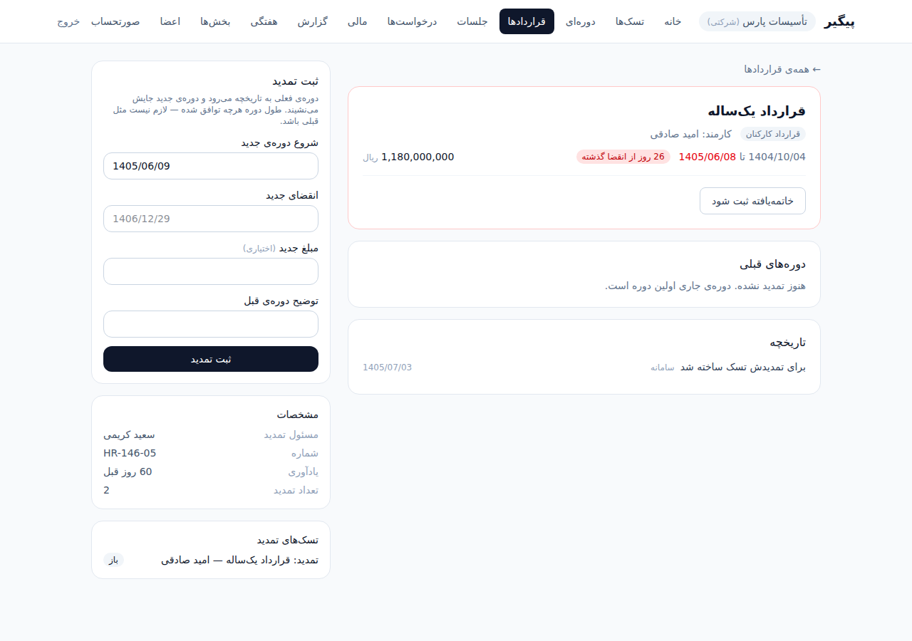
  <br><sub>پرونده‌ی یک قرارداد، با تاریخچه‌ی دوره‌ها</sub>
</p>

هر تمدید، دوره‌ی جاری را به `contract_terms` می‌فرستد و دوره‌ی جدید جایش
می‌نشیند. پس «چند بار تمدید شده و هر بار با چه مبلغی» را **پرونده** جواب
می‌دهد، نه حافظه‌ی کسی.

**خاتمه ≠ حذف.** قرارداد خاتمه‌یافته می‌ماند: اینکه چقدر دوام آورد و چقدر
ارزشش بود، دقیقاً همان چیزی است که یک سال بعد دنبالش می‌گردند.

### محافظ‌ها

- **یک تسک باز در هر لحظه** — وگرنه در پنجره‌ی ۶۰ روزه، شصت تسک یکسان برای یک قرارداد
- **قرارداد از قبل منقضی هم برداشته می‌شود** — وقتی شرکتی تازه پرونده‌هایش را وارد می‌کند، بیشترشان همین‌اند
- **دوره‌ای که قبل از شروعش تمام شود رد می‌شود** — وگرنه برای همیشه منقضی می‌ماند و هر شب تسک می‌سازد
- **تمدید و خاتمه، تسک باز را می‌بندند**

```bash
php artisan contracts:watch --dry
php artisan contracts:watch
```

روی کرون، هر روز ساعت ۷:۴۵.

---

## مالی: هزینه‌ها و مطالبات

<p align="center">
  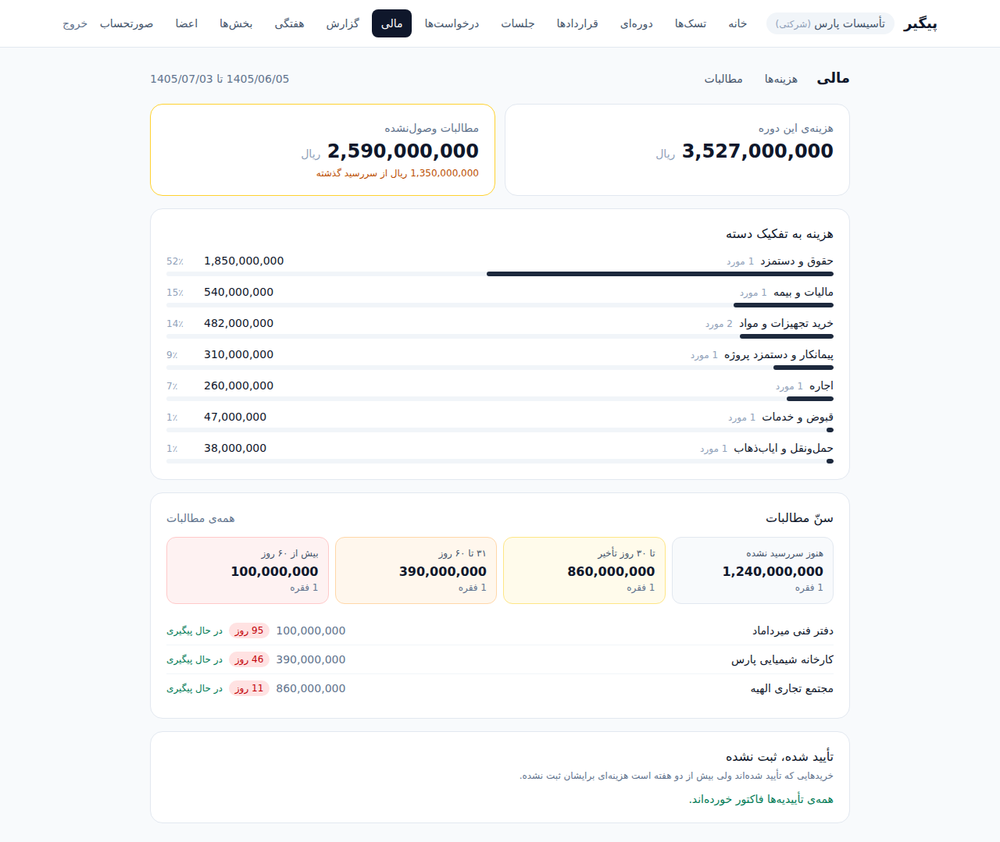
  <br><sub>گزارش مالی</sub>
</p>

`/finance` — فقط برای مالک و مدیران.

### این دفتر کل نیست، و عمداً نیست

اینجا **سند حسابداری، کدینگ، دفتر کل، ترازنامه و سامانه مؤدیان وجود ندارد.**
آن‌ها کار نرم‌افزار حسابداری‌ای است که شرکت از قبل دارد، و نسخه‌ی نصفه‌کاره‌شان
از نداشتنشان بدتر است: حسابدار شرکت یک بار امتحانش می‌کند، می‌بیند به درد
نمی‌خورد، و به مدیرعامل می‌گوید «این نرم‌افزار بی‌خوده» — و آن جمله کل قرارداد
را می‌برد، نه فقط این بخش را.

چیزی که اینجا هست، همان نیمه‌ای است که **نرم‌افزار حسابداری نمی‌تواند انجام
دهد، چون موتور پیگیری ندارد.**

### مطالبه‌ی معوق خودش تبدیل به تسک می‌شود

<p align="center">
  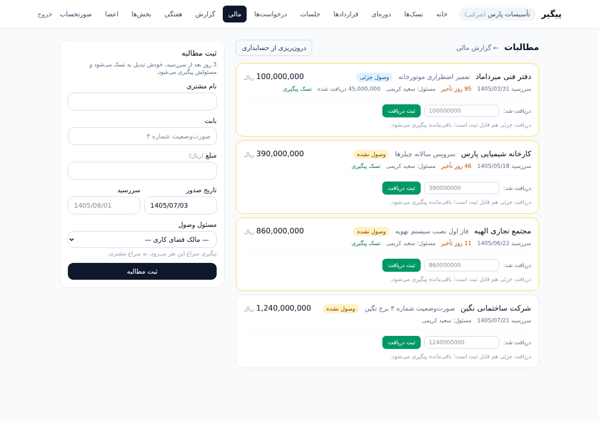
  <br><sub>مطالبات — ستون آخر نشان می‌دهد پیگیری هر فاکتور کجاست</sub>
</p>

این تنها قابلیت واقعیِ متمایز این بخش است:

```
سررسید گذشت  →  ۳ روز مهلت  →  تسک «پیگیری وصول» ساخته می‌شود
                                 →  اساین به مسئول وصول
                                 →  وارد نردبان: اعلان، پیامک، تشدید به مدیر
```

سپیدار هم می‌داند که فاکتور نود روز عقب افتاده. هر ماه در گزارش چاپش می‌کند و
هر ماه کسی گزارش را نمی‌خواند. **فرقش این است که اینجا اسم یک آدم رویش
می‌افتد و موتور سراغش می‌رود.**

| قاعده | چرا |
| --- | --- |
| **مشتری هرگز پیامک نمی‌گیرد** | خط اختصاصی که به غریبه درباره‌ی بدهی‌اش پیامک بزند، یعنی شکایت به رگولاتور. کسی که باید معذب شود، آدم داخل شرکت است که تلفن را برنداشته. |
| **۳ روز مهلت بعد از سررسید** | فاکتور یک روز عقب، معمولاً پولش در راه است. پیگیری‌اش هم اعتبار شما پیش مشتری را می‌برد هم اعتبار پیگیری را پیش کارمند. |
| **برای هر مطالبه فقط یک تسک** | `task_id` روی خود مطالبه. کرون شبانه‌ای که هر شب یک تسک تازه بسازد، تسک اول را دفن می‌کند و سقف پیامک روزانه‌ی طرف را می‌سوزاند. |
| **دریافت جزئی تسویه نیست** | باقی‌مانده همچنان پیگیری می‌شود. تسویه‌کردن با اولین قسط، همان جایی است که بقیه‌ی پول بی‌سروصدا گم می‌شود. |

```bash
php artisan receivables:chase --dry
php artisan recurrences:run --dry   # چه مطالباتی پیگیری می‌شوند
php artisan receivables:chase
```

روی کرون، هر روز ساعت ۸:۳۰ اجرا می‌شود.

### «تأیید شده، ثبت نشده»

عددی که هیچ‌جای دیگری نمی‌شود گرفت: **خریدهایی که تأیید شده‌اند ولی دو هفته
گذشته و هیچ فاکتوری برایشان ثبت نشده.** این گزارش فقط به این دلیل ممکن است که
گردش کار تأییدیه و هزینه‌ها در یک سامانه‌اند — نرم‌افزار حسابداری ثبت می‌کند
که پول خرج شد؛ این ثبت می‌کند که **چه کسی اجازه داد**، و کجا اجازه هست و خرج
نیست.

### ثبت هزینه با متن آزاد

<p align="center">
  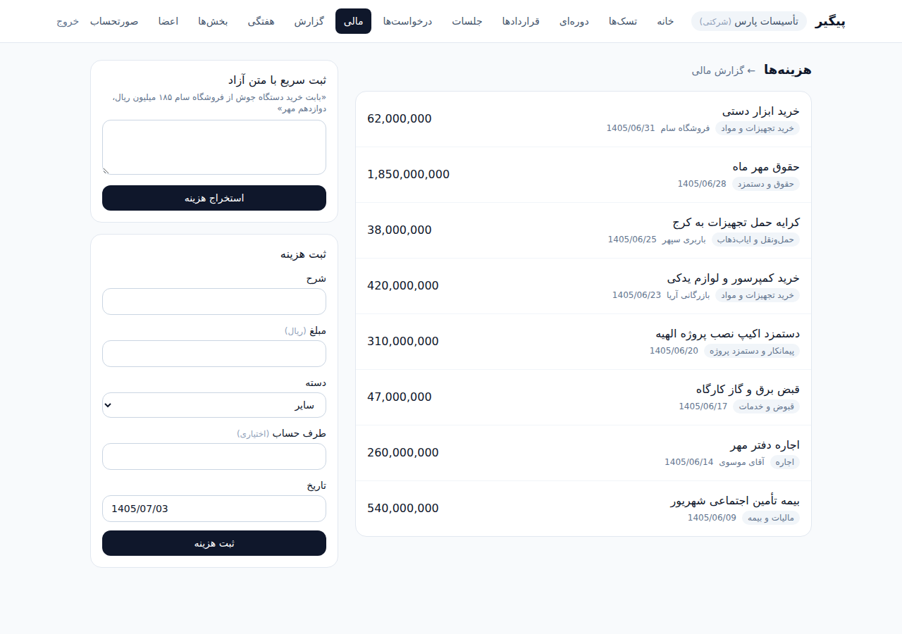
  <br><sub>یک جمله می‌نویسید، هزینه با مبلغ و دسته پیشنهاد می‌شود</sub>
</p>

> «بابت خرید دستگاه جوش از فروشگاه سام ۱۸۵ میلیون ریال، دوازدهم مهر»

سخت‌ترین بخشش کلمات نیست، عدد است: مبلغ ایرانی به شکل «۱۸۵ میلیون»،
«۱۸۵۰۰۰۰۰۰»، «۱۸.۵ میلیون تومان» و هر ترکیبی از ارقام فارسی و لاتین می‌آید، و
یک ضریب اشتباه یعنی گزارشی که ده برابر غلط است. برای همین مدل هم مبلغ به ریال
و هم واحدی که خودش خوانده را برمی‌گرداند، هر دو اینجا بررسی می‌شوند، و **مدیر
هر ردیف را قبل از ثبت تأیید می‌کند**.

### اتصال به نرم‌افزار حسابداری

<p align="center">
  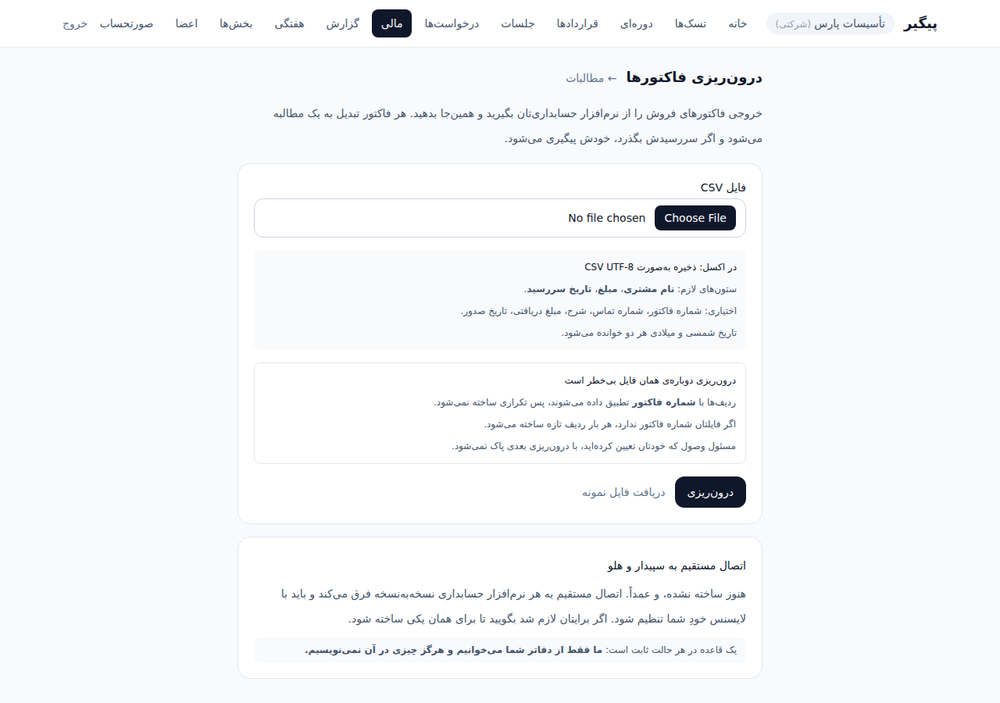
  <br><sub>درون‌ریزی فاکتورها از خروجی اکسل/CSV نرم‌افزار حسابداری</sub>
</p>

`/finance/import`

یک قاعده کل این لایه را شکل می‌دهد: **ما فقط از دفاتر مشتری می‌خوانیم و هرگز
چیزی در آن نمی‌نویسیم.** روزی که نرم‌افزار ما عددی در دفاتر کسی جابه‌جا کند،
حسابدارش می‌گوید «نرم‌افزار شما حساب‌هایمان را خراب کرد» — و آن جمله قابل دفاع
نیست، حتی وقتی درست نباشد.

و فقط دو چیز لازم داریم: **فاکتورهای فروش** و **دریافتی‌ها**. نه کدینگ، نه دفتر
کل. ما رقیب نرم‌افزار حسابداری نیستیم؛ ما همان بخشی از آن هستیم که تلفن را
برمی‌دارد.

| مرحله | وضعیت |
| --- | --- |
| **درون‌ریزی CSV** | ✅ آماده — با هر نرم‌افزار حسابداری کار می‌کند |
| اتصال مستقیم سپیدار / هلو | درگاهش آماده است (`App\Contracts\AccountingSource`)، ساختش منتظر اولین مشتری‌ای است که بخواهد |

**چرا CSV اول:** هر نرم‌افزار حسابداری ایرانی خروجی اکسل می‌دهد و هر حسابداری
در اکسل زندگی می‌کند. روز اول کار می‌کند و به هیچ فروشنده‌ای وابسته نیست.
اتصال مستقیم نسخه‌به‌نسخه و لایسنس‌به‌لایسنس فرق می‌کند، و ساختن پنج اتصال
قبل از داشتن پنج مشتری، راهِ مردن است.

سه چیزی که خروجی‌های واقعی ایرانی را می‌شکند و هندل شده: **BOM** اکسل روی سر
ستون اول، **سمی‌کالن** به‌جای کاما در ویندوز فارسی، و تاریخ که **شمسی و میلادی
هر دو** می‌آید.

| قاعده | چرا |
| --- | --- |
| تطبیق با **شماره فاکتور** | درون‌ریزی دوباره‌ی همان فایل، دفترها را دو برابر نمی‌کند. شرکتی که هر فاکتور را دو بار ببیند، دیگر به هیچ عددی اعتماد نمی‌کند. |
| ایندکس یکتا روی `(workspace_id, source, external_ref)` | چک‌کردن در PHP یک ریس‌کاندیشن با آپلود هم‌زمان فاصله دارد. |
| **مسئول وصول پاک نمی‌شود** | نرم‌افزار حسابداری مرجعِ پول است، نه مرجعِ اینکه چه کسی دنبالش است. |
| **مبلغ دریافتی عقب نمی‌رود** | خروجیِ قدیمی نباید فاکتور تسویه‌شده را باز کند و پیگیریِ مشتری‌ای که پول را داده شروع شود. |

---

### سنّ مطالبات

چهار سطل، همان‌هایی که در یک مکالمه‌ی وصول مطالبات واقعاً استفاده می‌شوند:
هنوز سررسید نشده · تا ۳۰ روز · ۳۱ تا ۶۰ روز · بیش از ۶۰ روز — که دیگر تأخیر
پرداخت نیست، مطالبه‌ی مشکوک‌الوصول است.

---

## پنل مدیریت کل

`/admin` — برای کسی که پیگیر را می‌فروشد، نه برای مشتری.

| صفحه | چه چیزی نشان می‌دهد |
| --- | --- |
| **نمای کلی** | درآمد ۳۰ روز اخیر و مقایسه با ۳۰ روز قبل، درآمد ماهانه‌ی تکرارشونده، تعداد مشتری به تفکیک پلن و وضعیت اشتراک، آزمایشی‌هایی که تا ۷ روز دیگر تمام می‌شوند، تمدیدهای ۱۴ روز آینده، اعتبار پنل پیامک، و هشدار اگر کرون نمی‌چرخد یا پرداختی تأیید نشده مانده |
| **مشتری‌ها** | همه‌ی فضاهای کاری، جستجو با نام یا **شماره‌ی هر عضو**، فیلتر پلن و وضعیت |
| **صفحه‌ی هر مشتری** | اعضا و نقش‌ها، کارهای باز و عقب‌افتاده، فاکتورها و پرداخت‌ها، رویدادها؛ **افزودن روز به اشتراک** و **سهمیه و روشن/خاموش پیامک** |
| **پرداخت‌ها** | همه‌ی تلاش‌های پرداخت؛ «پرداخت‌شده ولی تأییدنشده» جدا دیده می‌شود |
| **پیامک‌ها** | پیامک‌های پیگیری با متن و خطای پنل، جستجو با شماره‌ی گیرنده |

**دسترسی فقط با شماره.** در `.env`:

```ini
PLATFORM_ADMIN_PHONES=09134451502
```

با همین شماره مثل همه وارد شوید؛ کد پیامک می‌آید و مستقیم به پنل می‌روید. چند
نفر؟ با کاما جدا کنید. هر کس دیگری `/admin` را باز کند **۴۰۴** می‌بیند، نه «دسترسی
ندارید»؛ مشتری دلیلی ندارد بداند چنین صفحه‌ای هست. خالی گذاشتن یعنی هیچ‌کس.

هر روزی که از پنل اضافه می‌شود یا تغییر پیامک، در رویدادهای همان مشتری با برچسب
«پشتیبانی پیگیر» ثبت می‌شود.

## پرداخت و اشتراک

درگاه **SEP (پرداخت الکترونیک سامان)**، با فاکتور رسمی و ارزش افزوده.

```
PAYMENT_GATEWAY=sep        # تا وقتی ترمینال واقعی ندارید روی fake بماند
SEP_TERMINAL_ID=<شماره ترمینال شما>
VAT_PERCENT=10
```

### قاعده‌ای که کل این لایه رویش ساخته شده

> **کال‌بک سند پرداخت نیست.**

کال‌بک از مرورگرِ خودِ پرداخت‌کننده می‌آید و هرچه به آن مرورگر داده شده را
حمل می‌کند. هیچ‌چیز پرداخت‌شده علامت نمی‌خورد تا وقتی تأیید **سرور-به-سرور**
هم روی شماره‌ی مرجع و هم روی **مبلغ** موافقت کند.

مقایسه‌ی مبلغ داخل خود درگاه انجام می‌شود، نه در کد فراخوان — تا هیچ‌کس
نتواند فراموشش کند. فراموش کردنش یعنی کسی با ویرایش فرم، پلن ۵ میلیونی را
۱۰۰۰ ریال می‌خرد.

### چه چیزهایی پوشش داده شده

| خطر | محافظ |
| --- | --- |
| دستکاری مبلغ | تأیید سرور-به-سرور، مبلغ بانک با فاکتور مقایسه می‌شود |
| تحویل دوباره‌ی کال‌بک | اشتراک دو بار تمدید نمی‌شود |
| بازپخش شماره مرجع بانک | ایندکس یکتا روی `ref_num` |
| قیمت از فرم | قیمت همیشه از `config/payment.php` محاسبه می‌شود |
| درگاه در دسترس نیست | پرداخت باز می‌ماند و بعداً تأیید می‌شود، نه اینکه باطل شود |
| دسترسی بین‌شرکتی | فاکتور شرکت دیگر ۴۰۴ می‌دهد |

### پلن‌ها

| پلن | قیمت | سقف کاربر | پیامک ماهانه |
| --- | --- | --- | --- |
| خانوادگی | ۹۹ هزار تومان / ماه | ۶ | ۱۰۰ |
| دوستانه | ۱۴۹ هزار تومان / ماه | ۱۵ | ۲۰۰ |
| **شرکتی** | **۲۰۰ هزار تومان / هر کاربر / ماه** | ۵۰۰ (حداقل ۵) | ۵۰۰ |

سالانه = **۱۰ ماه** (دو ماه رایگان). ارزش افزوده جداگانه روی فاکتور می‌آید،
چون واحد مالی بدون آن پرداخت را پردازش نمی‌کند.

<p align="center">
  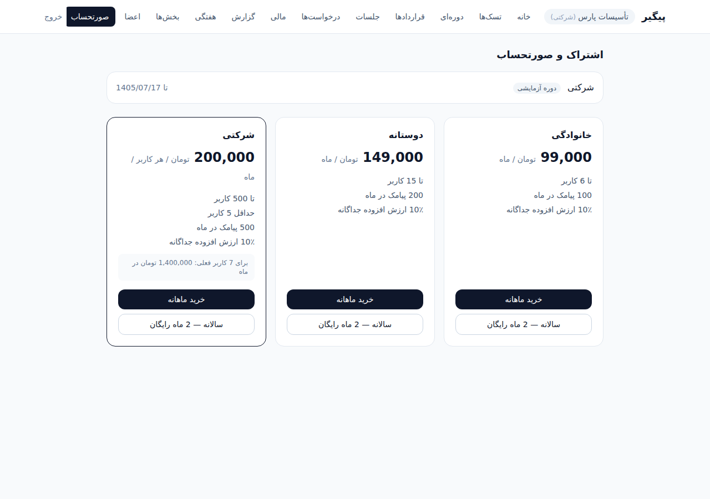
  <br><sub>صفحه‌ی صورتحساب و اشتراک</sub>
</p>

### اجرای اشتراک

اشتراک منقضی، سامانه را **فقط‌خواندنی** می‌کند — قفل نمی‌کند:

- خواندن همه‌چیز آزاد است. قفل کردن مشتری از دیتای خودش او را عصبانی می‌کند،
  نه پولده — زنگ می‌زند شکایت کند، نه پرداخت.
- ثبت هر تغییری به صفحه‌ی صورتحساب برمی‌گردد، با بنری که **در هر صفحه** می‌ماند
  و می‌گوید چرا.
- صفحه‌ی صورتحساب هیچ‌وقت پشت دیوار پرداخت نیست؛ صفحه‌ای که پول می‌گیرد نباید
  بسته باشد.
- **موتور پیگیری هم متوقف می‌شود.** هر پیامک برای ما پول واقعی است و نباید
  برای مشتری غیرفعال خرج شود. مهلت ارفاق استثناست: یک هفته حسن‌نیت ارزان‌تر از
  ریزشی است که قطع ناگهانی می‌سازد.

دوره آزمایشی **در لحظه‌ی ثبت‌نام** شروع می‌شود، نه اولین پرداخت — وگرنه مشتری
تازه، قبل از اینکه یک بار محصول را کار ببیند، به دیوار پرداخت می‌خورد.

### تمدید: پرداخت خودکار وجود ندارد

درگاه‌های ایرانی پرداخت دوره‌ای کارت ندارند، پس هر تمدید یعنی یک آدم تصمیم
گرفته دوباره پول بدهد. برای همین:

```bash
php artisan subscriptions:sweep
php artisan receivables:chase --dry   # روزانه، از طریق زمان‌بند
```

- یادآوری پیامکی در **۷، ۳ و ۱ روز** مانده (هر آستانه فقط یک بار)
- بعد از انقضا، **۷ روز مهلت ارفاق** — دسترسی قطع نمی‌شود
- بعد از مهلت، منقضی

از دست دادن مشتری راضی به خاطر تمدید فراموش‌شده، قابل‌اجتناب‌ترین ریزشی است
که وجود دارد.

---

## تعطیلات رسمی

موتور پیگیری به جدول `holidays` وابسته است. بدون آن، سامانه در نوروز و عاشورا
به آدم‌ها پیامک می‌زند — و مشتری‌ای که در نوروز پیگیری می‌شود تمدید نمی‌کند.

```bash
php artisan holidays:seed          # تعطیلات ثابت شمسی سال جاری
php artisan holidays:seed 1406     # یا یک سال مشخص
```

تعطیلات مذهبی از تقویم قمری پیروی می‌کنند و هر سال حدود ۱۱ روز جابه‌جا
می‌شوند، پس قابل محاسبه نیستند و دستی اضافه می‌شوند:

```bash
php artisan holidays:add 1405/04/12 عاشورا
```

**هر سال این را انجام دهید.** یک یادداشت در تقویم خودتان بگذارید.

---

## نصب روی گوشی (PWA)

<p align="center">
  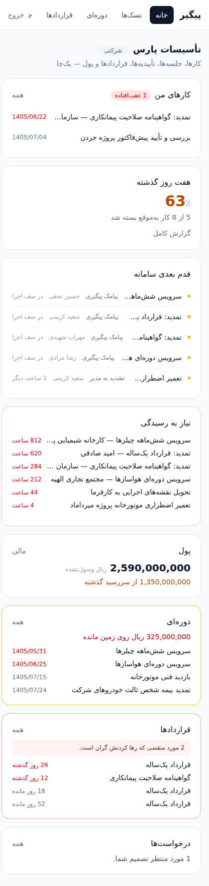
  &nbsp;
  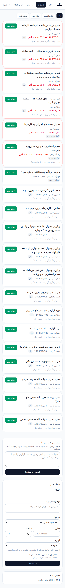
  <br><sub>روی گوشی، مثل یک اپ</sub>
</p>

سامانه روی گوشی نصب می‌شود. مخاطب اصلی‌اش **نیروی فیلدی** است که در موتورخانه
با یک خط آنتن بازش می‌کند، نه کسی که پشت میز نشسته.

| فایل | نقش |
| --- | --- |
| `public/manifest.webmanifest` | RTL، فارسی، standalone، آیکون maskable |
| `public/sw.js` | سرویس‌ورکر |
| `public/offline.html` | صفحه‌ی آفلاین |

**صفحه‌ی شروع `‎/tasks?filter=mine`** است، نه کل لیست — روی گوشی در زیرزمین،
یک تپ کمتر ارزش دارد.

### دو تصمیم که عمدی‌اند

**۱. هیچ صفحه‌ای که وضعیت تسک دارد کش نمی‌شود.** لیست تسک کهنه بدتر از
نبودن لیست است: به کسی می‌گوید کاری هنوز باز است که یک ساعت پیش بسته شده.
فقط فایل‌های بیلد (که هش محتوا دارند) کش می‌شوند.

**۲. درخواست‌های غیر GET دست‌نخورده رد می‌شوند.** اگر تکنسین آفلاین دکمه‌ی
«انجام شد» را بزند، باید **بلند شکست بخورد**، نه اینکه بی‌صدا بلعیده شود.
صفحه‌ی آفلاین هم یادآوری می‌کند که همان پیامک پیگیری را می‌تواند پاسخ دهد:
**۱ = انجام شد**.

---

## استقرار روی سرور

**راهنمای کامل و قدم‌به‌قدم برای سرور مجازی ایرانی:
[`docs/deploy/README.md`](docs/deploy/README.md)** — از خرید سرور تا `https`، صف، کرون،
بکاپ، آموت، سامان و اولاما. کانفیگ nginx، PHP-FPM، supervisor و اسکریپت‌های
`deploy.sh` و `backup.sh` هم کنارش هستند.

### دو چیزی که بدون آن‌ها موتور نمی‌چرخد

```bash
# ۱. کرون سرور
* * * * * cd /path/to/app && php artisan schedule:run >> /dev/null 2>&1

# ۲. اجراکننده‌ی صف (با supervisor یا systemd)
php artisan queue:work --tries=3
```

زمان‌بند این‌ها را می‌چرخاند: پیگیری‌ها (هر ۵ دقیقه)، گزارش هفتگی (ساعتی)، و
کارهای روزانه به **وقت تهران**: کارهای دوره‌ای ۷:۳۰، قراردادها ۷:۴۵، مطالبات
۸:۳۰ و اشتراک‌ها ۹:۰۰. دیتابیس روی UTC می‌ماند؛ فقط زمان‌بند با
`SCHEDULE_TIMEZONE` (پیش‌فرض `Asia/Tehran`) خوانده می‌شود.

بدون کرون هیچ پیگیری و هیچ گزارشی فرستاده نمی‌شود. بدون صف، پیامک ورودی
پردازش نمی‌شود.

### چک‌لیست تولید

- [ ] `APP_ENV=production` و `APP_DEBUG=false`
- [ ] `php artisan config:cache route:cache view:cache`
- [ ] `npm run build`
- [ ] `SMS_DRIVER=amoot` **فقط بعد از تأیید پترن‌ها**
- [ ] وب‌هوک ورودی در پنل آموت ثبت شده و `AMOOT_INBOUND_SECRET` ست است
- [ ] `php artisan holidays:seed` اجرا شده و تعطیلات قمری دستی اضافه شده
- [ ] `MAIL_FROM_ADDRESS` روی دامنه‌ی خودتان با SPF و DKIM
- [ ] `PAYMENT_GATEWAY=sep` و `SEP_TERMINAL_ID` **فقط بعد از تست با ترمینال واقعی**
- [ ] `https` اجباری — درگاه بانک روی http کال‌بک نمی‌دهد
- [ ] بکاپ خودکار دیتابیس

---

## توسعه

```bash
php artisan test                   # ۴۵۸ تست
./vendor/bin/pint                  # قالب‌بندی کد
php artisan followups:run --dry    # چه پیگیری‌هایی سررسید شده‌اند
php artisan reports:weekly --workspace=1
php artisan subscriptions:sweep
```

تست‌ها روی SQLite در حافظه اجرا می‌شوند، مستقل از MySQL تولید.

### ساختار

```
app/
├── Ai/Providers/        اولاما و null object
├── Console/Commands/    followups:run و reports:weekly
├── Contracts/           SmsDriver، AiProvider و PaymentGateway
├── Payments/Gateways/   sep و fake
├── Enums/               وضعیت‌ها، پله‌ها، نقش‌ها
├── Services/            موتور پیگیری، دروازه‌ی مهار، گزارش‌ها، OTP
├── Sms/Drivers/         amoot، log، fake
└── Support/             شماره تلفن، متن فارسی، تاریخ شمسی
```

---

## تصمیم‌های معماری

**چندمستأجری** با `workspace_id` روی همه‌چیز و `CurrentWorkspace` به‌عنوان تنها
راه دسترسی. تسک فضای کاری دیگر **۴۰۴** می‌دهد نه ۴۰۳ — گفتن اینکه رکوردی وجود
دارد ولی مال شما نیست، خودش نشت است.

**شماره موبایل هویت است.** بدون رمز، بدون ایمیل. عضوی که مدیرش با نام و شماره
ثبت کرده، **از همان لحظه قابل اساین شدن است، حتی اگر هرگز وارد سامانه نشود**.
این همان تمایزی است که رقیب ندارد.

**تاریخ شمسی فقط در لایه‌ی نمایش.** دیتابیس میلادی و UTC است. تبدیل جایی انجام
می‌شود که آدم تاریخ را می‌خواند یا می‌نویسد.

**اعتبار پیامک** فقط بعد از پذیرش سرویس مصرف می‌شود، و **بر حسب بخش پیامک**
شمرده می‌شود چون همان چیزی است که فاکتور می‌شود.

**پیامک ورودی اول خام ذخیره می‌شود، بعد تفسیر.** قواعد تطبیق در ماه‌های اول غلط
از آب درمی‌آیند و این تنها راه بازپخش آن‌ها روی ترافیک واقعی است.

**ساعت سکوت پیامک را به تعویق می‌اندازد، حذف نمی‌کند.** یکی‌کردن این دو، همان
چیزی است که باعث می‌شود سیستم آخر هفته ساکت شود و دیگر برنگردد.

**تشدید از لحظه‌ی ارسال واقعی پیگیری محاسبه می‌شود**، نه از ددلاین — تا پیامکی
که شب معطل مانده، تشدیدش را به نیمه‌شب نکشاند.
